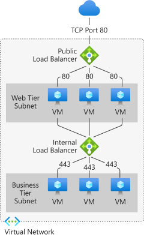

## Table of Contents

[Azure 일반](#azure-일반)

+--- [상태 어드바이저](#azure-상태-어드바이저)

[Azure Network 1](#azure-network-1)

+--- [1. Virtual Network (VNet)](#1.-virtual-network-(vnet))

+--- [2. Subnet](#2.-subnet)

+--- [3. VNet Peering](#3.-vnet-peering)

+--- [4. NIC (Network interface card)](#4.-nic-(network-interface-card))

+--- [5. Network Security Group](#5.-nsg-(network-security-group))

+--- [6. Load Balancer](#6.-load-balancer)

+--- [Health Probe](#health-probe)

+--- [VPN (Virtual Private Network)](#vpn-(virtual-private-network))

​		+--- [(1) P2S VPN](#(1)-p2s-(point-to-site)-vpn)

​		+--- [(2) S2S VPN](#(2)-s2s-(site-to-site)-vpn)

---

# Azure 일반

### 상태 어드바이저 : Azure Service Health

> [Azure Service Health](https://docs.microsoft.com/ko-kr/azure/service-health/)

Azure는 클라우드 리소스의 상태에 대해 지속적으로 알려주는 Azure Service Health를 제공하며, Azure 서비스의 문제가 사용자에게 영향을 주는 경우 맞춤형 지침 및 지원을 제공한다. Azure Service Health는 Azure Health, Service Health, Resource Health 서비스라는 3가지 서비스로 구성되어 있다.

1. Azure status
   - Azure Status 페이지에서 Azure의 서비스 중단을 사용자에게 알려준다.
   - Azure 상태 페이지는 항상 최신 상태 정보를 표시하지만 상태 기록 페이지를 사용해 이전 이벤트를 볼 수 있다.
2. Service Health
   - 사용하는 영역에 있는 Azure 서비스의 상태를 추적하는 대시보드 제공
   - 이벤트가 비활성화되면 최대 90일 동안 상태 기록에 저장 및 열람 가능
   - 대시보드를 사용해 서비스 문제로 인해 영향이 발생할 경우 사전에 알려주는 서비스 상태 경고 생성 및 관리 가능
3. Resource Health
   - Azure Resource Health를 통해 Azure Resource에 영향을 주는 서비스 문제를 진단하고 지원을 받을 수 있음
   - 리소스의 현재와 과거 상태를 보고
   - 리소스는 가상 머신, 웹 앱 또는 SQL Database와 같은 Azure 서비스의 특정 인스턴스
   - Resource Health는 서로 다른 Azure 서비스의 시그널에 의존하여 리소스 정상 여부 평가

---

# Azure Network 1

## 1. Virtual Network (VNet)

> [Azure Virtual Network 란?](https://docs.microsoft.com/ko-kr/azure/virtual-network/virtual-networks-overview)

- VNet은 Azure에서 Private Network (일종의 Switch 단)의 기본 구성 요소이며 독립된 하나의 네트워크 체계로, 논리적으로 격리된 가상의 네트워크
- 같은 VNet에 속한 리소스 (VM 등)는 내부적으로 통신 가능하지만 다른 VNet에 속한 리소스와는 기본적으로 내부 통신이 불가능
- 다른 VNet 끼리 통신을 하기 위해서는 VNet VPM 또는 VNet Peering을 통해 통신 가능
- Subnet은 기존 On-Premise의 Subnet과 동일한 개념
- IP 대역은 임의로 지정 가능
- 다수의 작은 VNet보다 적은 수의 큰 VNet을 사용하는 것이 좋다.
  - management 오버헤드 방지

## 2. Subnet

- Subnet은 On-Premise에서의 Subnet과 동일하며, 가상 네트워크를 하나 이상의 하위 네트워크로 분할하고 가상 네트워크 주소 공간의 일부를 각 서브넷에 할당
- 하나의 네트워크로 서로 나뉘어진 서브넷끼리는 라우터를 통해서만 통신이 가능
- Subnetting의 가장 기본적인 목적은 _**네트워크 분리/관리**_ 이며 이를 통해 IP 주소를 **보다 효율적으로 낭비없이** 쓰고 큰 네트워크를 작게 쪼게어 **브로드캐스트의 영향**을 감소
- 일반적으로 사용되는 Ethernet의 경우 CSMA/CD (Carrier Sense Multiple Access/Collision Detection) 프로토콜을 사용하므로 너무 잦은 브로드캐스트는 네트워크에 속한 모든 PC의 CPU 성능을 떨어뜨리고 네트워크에서 데이터 전송을 불가능하게 함
- 따라서 Subnetting으로 브로드캐스트 도메인을 축소시켜 하나의 브로드캐스트에 영향을 덜 받게끔 하는것에 Subnetting의 한 목적이 있음

## 3. VNet Peering

> [Azure VNet Peering](https://docs.microsoft.com/ko-kr/azure/virtual-network/virtual-network-peering-overview)

VNet Peering을 사용하면 Azure에서 두 개 이상의 VNet을 원활하게 연결 가능하다. 피어링된 VNet에서 VM 사이의 트래픽은 Gateway나 공용 인터넷이 아니라 Microsoft backbone 인프라를 통해 직접 라우팅된다.  
Azure는 두 가지 형태의 피어링을 지원한다.

- VNet peering : 동일 region에서 VNet 연결
- Global VNet peering : 서로 다른 region의 VNet 연결
  
## 4. NIC (Network Interface Controller)

> [Understanding Azure NIC](https://social.msdn.microsoft.com/Forums/en-US/c4a1410c-ca52-4acb-bb1d-d1e0ed90c82a/understanding-azure-nic?forum=WAVirtualMachinesVirtualNetwork)

- Network interface (NIC) 는 VM과 VNet 사이의 상호 연결 (interconnection)
- VM은 하나 이상의 NIC를 가질 수 있으며 NIC를 증감 가능
- NIC는 Subnet에 종속적
- 하나의 NIC에 다수의 IP 붙일 수 있음

## 5. NSG (Network Security Group)

> [Network Security Group](https://docs.microsoft.com/ko-kr/azure/virtual-network/network-security-groups-overview)

- 보안 규칙의 집합으로 일종의 방화벽
- IP와 Port를 기반으로 VNet에서 Azure resource에 대한 네트워크 트래픽을 필터링
- Default 보안 규칙은 기본적으로 적용되며 제거할 수 없지만 우선 순위를 조정해 적용 배제 가능
- 특별한 이유가 없는 경우, Subnet이나 NIC에 연결하는 것이 좋다.
  - Subnet에 연결된 NSG의 Rule이 NIC에 연결된 NSG의 Rule과 충돌 가능

## 6. Load Balancer

> [Azure Load Balancer란?](https://docs.microsoft.com/ko-kr/azure/load-balancer/load-balancer-overview)

- Load balance : 백 엔드 리소스나 서버의 그룹에서 load(들어오는 Network traffic)을 효율적으로 분산시키는 것
- Azure Load Balancer는 OSI model의 layer 4에서 동작
- Load balancer의 Front-end에서의 inbound traffic을 미리 구성된 load balance policy나 health probe에 따라 Back-end pool instance로 분산
- Load Balancer는 External (or Public), Internal (or private) Load Balancer로 구분

  1. External Load Balancer
     - VNet 내의 VM에 대해 Out-Bound connection을 제공
     - Private IP Address를 Public IP Address로 변환해서 진행
     - 결과적으로 Internet traffic load를 VM에 분산하는 역할

  2. Internal Load Balancer
     - VNet 내부에서 사용되는 Load Balancer
     - VNet 내부의 traffic을 분산시킬 떄 사용

## Health Probe

## VPN (Virtual Private Network)

일반적으로 private network와 private network를 연결하는데는 2가지 방법이 있는데 하나는 network를 전용선으로 연결하는 방법이다. 그러나 이 방법은 전용선 구축을 위한 물리적인 방법이 필요하다. 따라서 Public network(internet)을 전용선처럼 활용하고 암호화 기술을 적용해 보안성을 높인 private network 간 연결을 구축하는 방식을 VPN (Virtual Private Network)이라고 한다.

### (1) P2S (Point-to-Site) VPN

개별 client와 network 간 연결

### (2) S2S (Site-to-Site) VPN

network와 network 간 연결

Azure VNet -------------------- IDC

ER -----------------------------------ER

VPN (Pub.IP)         VPN (Pub.IP)