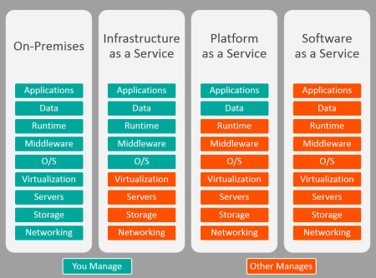

# 클라우드 컴퓨팅이란?

CPU, RAM, Storage 같은 Computing resource 를 인터넷을 통해 원하는 때에 제공받고 사용한 만큼 지불하는 서비스이다.

## Computing

> CPU, Memory 가 원래 의미이지만, 최근 AI, Big Data 등의 요인으로 GPU 나 Network Interface 등의 resource 수요가 증가해 Computing resource 에 해당 Resource를 포함하는 경우도 있음.

### 컨테이너 (Container) 란?

> Reference : [subicura님 블로그 : 초보를 위한 도커 안내서 - 도커란 무엇인가?](https://subicura.com/2017/01/19/docker-guide-for-beginners-1.html)

- 기존의 가상화 (VMware, VirtualBox 등의 VM) 방식은 OS를 가상화하는 방식
  - 여러가지 OS를 가상화 할 수 있고 비교적 사용법이 간단하지만 리소스를 많이 사용하고 느리다.

- 성능 문제를 개선하기 위해 프로그램 실행 환경을 추상화하여 격리된 공간에서 Process가 동작하는 방식의 가상화
  - 가볍고 빠르며, CPU나 메모리는 Process가 필요한 만큼만 추가로 사용
  - 하나의 서버에서 다수의 컨테이너 실행 시 서로 독립적으로 실행 (의존성 문제 해결)
  - 새로운 컨테이너 생성시간이 1 ~ 2초 정도로 굉장히 빠르다.

### 서버리스(Serverless) 컴퓨팅이란? 

> Reference : [Samsung SDS insights (클라우드 패러다임의 전환 - 서버리스 컴퓨팅)](https://www.samsungsds.com/kr/insights/1232763_4627.html)

클라우드 서비스 공급자가 서버를 관리, 실행하며 요청이나 특정 이벤트가 있을 때 클라우드 서버를 이용하거나 서비스할 애플리케이션을 동작시키는 것을 의미한다. 이를 통해 사용자(개발자)는 서버 관리에서 완전히 자유로워지며 실제 구현해야 할 기능에 더 집중할 수 있게 된다. 애플리케이션 관점에서 `BaaS (Backend as a Service)`와 `FaaS (Function as a Service)`로 구분할 수 있다.

#### 1. BaaS (Backend as a Service)

- 단일 웹페이지나 모바일 앱 기반의 서비스에서 필요한 서버 기능들을 사용하기 위해 이용하는 써드파티 애플리케이션이나 클리우드 서비스
- 쉽게 말해, 애플리케이션 개발 시 요구되는 복잡한 백앤드 기능들을 사용자(개발자)가 직접 개발하지 않고 클라우드 공급자가 제공하는 서비스를 이용해 쉽고 안정적으로 구현하는 것
- 주된 사용 대상이 모바일 앱과 웹 앱(WebApp)이다 보니 `MBaaS (Mobile Backend as a Service)`라 불리는 시장이 활성화 되는 추세
- 예] 클라우드 데이터베이스 서비스인 `Firebase`나 클라우드 인증 서비스인 `Auth0`가 BaaS에 해당

#### 2. FaaS (Funtion as a Service)

- 클라우드 서비스 공급자가 제공하는 서버 기능을 단순하게 이용한다면, FaaS는 사용자가 쓸 기능을 함수 단위로 나누어 구현하고 이를 서비스하는 형태
- `FaaS`는 Event-Driven 아키텍처를 구현하는데 적합하며 사용자가 원하는 기능을 미리 작성해놓고 특정 이벤트 (HTTP Request, API 호출, 특정 조건 등)에 의해 실행
- 이 때 서버는 계속 대기하면서 이벤트를 기다리지 않고 이벤트 발생 시 마다 실행
- `FaaS` 구현한 대표적인 서비스 : `Azure Functions`, `AWS Lambda,` `Google Cloud functions` 등

#### 서버리스의 장점과 고려사항

1. 장점
   - `IaaS`나 `PaaS`와 같이 상시 운영 중인 서버와 달리 요청에 따라 호출되어 처리되므로 운영 비용 절감 효과가 있다.
   - 일반적인 클라우드 서비스와 같이 특정 조건에 따라 확장되는 방식이 아닌, 호출될 때마다 새로운 인스턴스가 기동되어 동작하기 때문에 급격한 트래픽 변화에 더 유연한 대응이 가능하다.
   - 기능이 함수 단위로 개발되므로 서비스 출시가 빠르고 간단하다.

2. 제약 사항
   - 실행되는 함수가 호출되기 위해 컨테이너가 실행되는 대기 시간 (`Cold-Start`)이 존재하므로, **빠른 응답이 필요한 제품**의 경우 서버리스로의 전환은 부적합할 수 있다.
   - 하나의 작은 기능으로 나뉘어진 함수들은 요청마다 새로 기동되어 호출되므로 전후 상태를 공유할 수 없고 변수와 데이터 공유가 불가능하므로, **무상태(`Stateless`)적인 기능으로 구현**되어야 한다.
   - 함수 내에서 사용할 수 있는 최대 메모리, 최대 처리 가능 시간 제약 등 **서버리스 서비스 벤더가 제한을 두는 사항을 그대로 수용**해야 한다. 따라서 큰 기능을 잘게 나누어 구현해야 한다.

---

# 클라우드 컴퓨팅의 혜택

## 확장성

특정 시간의 수요 또는 워크로드에 따라 사용되는 리소스와 서비스를 늘리거나 줄일 수 있다. 클라우드 컴퓨팅은 요구 사항에 따라 `수직적` 및 `수평적` 크기 조정을 지원한다.

- 수직적 크기 조정 (`Scale-up`)

  기존 서버의 성능을 증가시키기 위해 리소스(CPU, Memory 등)를 추가하는 방법

- 수평적 크기 조정 (`Scale-out`)

  인스턴스의 수를 증가시키는 방법

## 탄력적

수요의 급격한 증감으로 워크로드가 변경되면 클라우드 컴퓨팅 시스템은 자동으로 리소스를 보정할 수 있다.

## 최신 상태

호스트 OS, 하드웨어 설치, 업그레이드 및 기타 IT 관리 작업을 유지 관리를 클라우드 서비스 공급자 측에서 부담한다.

## 전 세계에서 사용 가능

클라우드 공급자는 전 세계의 다양한 지역에 다수의 데이터 센터를 갖추고 있으므로, 지역에 관계 없이 최적의 응답 시간을 제공 받을 수 있다.

---

# 클라우드 배포 모델

## 퍼블릭(Public) 클라우드

- 가장 일반적인 모델로 모든 작업은 클라우드 공급자의 하드웨어에서 실행되며 서비스는 공용 인터넷을 통해 제공된다.
- Microsoft Azure, Amazone AWS, Google GCP 등이 대표적이다
- 하드웨어 또는 서비스를 고객사가 소유하지 않으므로 금융, 공공기관 등은 까다로운 보안 관련 규제를 충족하기 어려울 수 있다.
- 레거시 시스템을 유지하는데 필요한 요구사항이 충족되기 어려울 수 있다.

## 프라이빗(Private) 클라우드

- 기존의 IDC에 클라우드 컴퓨팅을 접목한 모델로 고객사가 하드웨어, 소프트웨어 서비스 구매 및 유지 관리에 대한 책임을 갖는다.
- 고객사의 IDC에 구성되므로 레거시 시스템 지원, 법적 보안 규제 준수 등이 가능하다.
- 기존의 On-Premise 가 갖는 단점을 동일하게 갖는다.

## 하이브리드(Hybrid) 클라우드

- `퍼블릭 + 프라이빗`이 결합된 모델로 각각의 장점만을 취할 수 있는 모델이다.
- 국내에 아직 구현된 레퍼런스가 없다.
- 기존의 On-Premise 환경이 구축되어 있지 않은 경우, 초기 비용과 인력 유지 문제 등이 그대로 이어진다.

---

# 서비스 형태에 따른 구분

> 클라우드 컴퓨팅은 크게 IaaS, SaaS, PaaS 로 구분한다.

## 1. IaaS (Infrastructure as a Service)

가장 넓은 범위의 클라우드 서비스로 VM를 최대한 제어하는 것이라고 볼 수 있다.

## 2. PaaS (Platform as a Service)

소프트웨어 애플리케이션을 빌드하고, 테스트하고, 배포하는 환경을 제공한다. 기본 인프라를 관리하지 않고 최대한 빠르게 애플리케이션을 만드는 것을 지원 목적으로 하며 일반적으로 사용되는 경우는 다음과 같다.

- 개발 프레임워크 
  PaaS는 개발자가 클라우드 기반 애플리케이션을 개발하거나 구축할 수 있는 프레임워크를 제공
- 분석 또는 비즈니스 인텔리전스
  PaaS에서 제공되는 일종의 툴로써 데이터를 분석하고 마이닝할 수 있다.

## 3. SaaS (Service as a Service)

중앙에서 호스트되고 관리되는 소프트웨어이며 일반적으로 모든 고객이 동일한 버전의 애플리케이션을 사용하고 월 또는 연간 구독으로 라이선스가 부여된다.

## 관리 책임

- IaaS의 경우 게스트 OS, 데이터, 애플리케이션을 사용자가 관리해야 한다.
- PaaS의 경우 사용자는 자신이 실행하고자 하는 애플리케이션과 저장하고자 하는 데이터를 관리해야 한다.
- SaaS의 경우 사용자는 소프트웨어를 사용하기만 한다. (= 관리 부담이 없다)