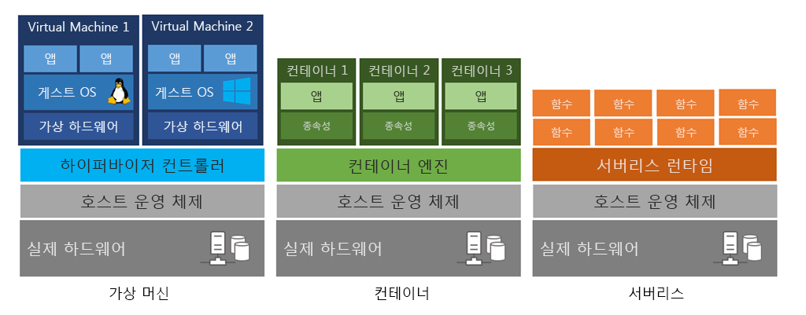

# 클라우드 컴퓨팅이란?

CPU, RAM, Storage 같은 Computing resource 를 인터넷을 통해 원하는 때에 제공받고 사용한 만큼 지불하는 서비스이다.

## Computing

> CPU, Memory 가 원래 의미이지만, 최근 AI, Big Data 등의 요인으로 GPU 나 Network Interface 등의 resource 수요가 증가해 Computing resource 에 해당 Resource를 포함하는 경우도 있음.

### 컨테이너 (Container) 란?

> Reference : [subicura님 블로그 : 초보를 위한 도커 안내서 - 도커란 무엇인가?](https://subicura.com/2017/01/19/docker-guide-for-beginners-1.html)

- 기존의 가상화 (VMware, VirtualBox 등의 VM) 방식은 OS를 가상화하는 방식
  - 여러가지 OS를 가상화 할 수 있고 비교적 사용법이 간단하지만 리소스를 많이 사용하고 느리다.

- 성능 문제를 개선하기 위해 프로그램 실행 환경을 추상화하여 격리된 공간에서 Process가 동작하는 방식의 가상화
  - 가볍고 빠르며, CPU나 메모리는 Process가 필요한 만큼만 추가로 사용
  - 하나의 서버에서 다수의 컨테이너 실행 시 서로 독립적으로 실행 (의존성 문제 해결)
  - 새로운 컨테이너 생성시간이 1 ~ 2초 정도로 굉장히 빠르다.

### 서버리스(Serverless) 컴퓨팅이란? 

> Reference : [Samsung SDS insights (클라우드 패러다임의 전환 - 서버리스 컴퓨팅)](https://www.samsungsds.com/kr/insights/1232763_4627.html)

클라우드 서비스 공급자가 서버를 관리, 실행하며 요청이나 특정 이벤트가 있을 때 클라우드 서버를 이용하거나 서비스할 애플리케이션을 동작시키는 것을 의미한다. 이를 통해 사용자(개발자)는 서버 관리에서 완전히 자유로워지며 실제 구현해야 할 기능에 더 집중할 수 있게 된다. 애플리케이션 관점에서 BaaS (Backend as a Service)와 FaaS (Function as a Service)로 구분할 수 있다.

1. BaaS (Backend as a Service)
   - 단일 웹페이지나 모바일 앱 기반의 서비스에서 필요한 서버 기능들을 사용하기 위해 이용하는 써드파티 애플리케이션이나 클리우드 서비스
   - 쉽게 말해, 애플리케이션 개발 시 요구되는 복잡한 백앤드 기능들을 사용자(개발자)가 직접 개발하지 않고 클라우드 공급자가 제공하는 서비스를 이용해 쉽고 안정적으로 구현하는 것
   - 주된 사용 대상이 모바일 앱과 웹 앱(WebApp)이다 보니 MBaaS (Mobile Backend as a Service)라 불리는 시장이 활성화 되는 추세
   - 예] 클라우드 데이터베이스 서비스인 Firebase나 클라우드 인증 서비스인 Auth0가 BaaS에 해당
2. FaaS (Funtion as a Service)
   - 클라우드 서비스 공급자가 제공하는 서버 기능을 

---

# 클라우드 컴퓨팅의 혜택

## 확장성

## 탄력적

## 최신 상태

## 전 세계에서 사용 가능

---

# 클라우드 배포 모델

## 퍼블릭 클라우드

## 프라이빗 클라우드

## 하이브리드 클라우드

