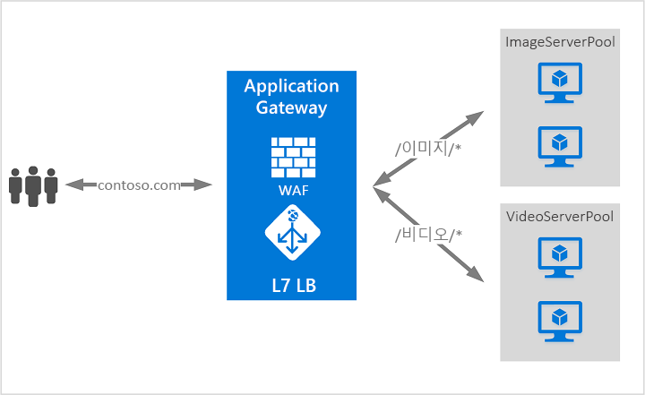
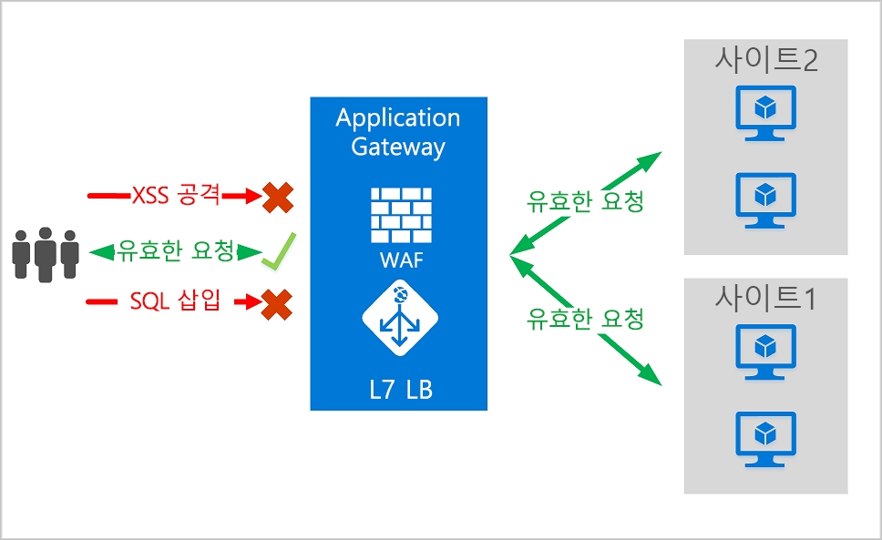
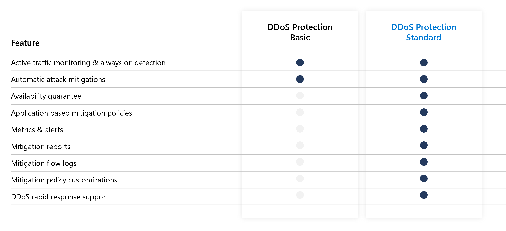
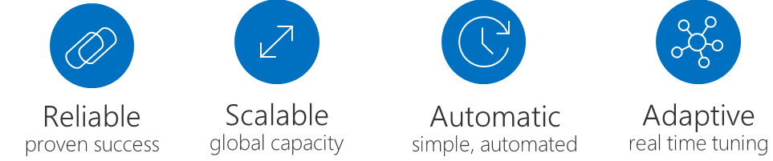

# Azure Networking 2

[ Table of Contents ]

#### [1. Azure DNS](#1.-azure-dns)

#### [2. Traffic Manager](#2.-traffic-manager)

#### [3. Application Gateway (with WAF)](#3.-application-gateway-with-waf))

#### [4. Azure DDoS Protection](#4.-azure-ddos-protection)

---

## 1. Azure DNS

> [_**Azure DNS**_ 란?](https://docs.microsoft.com/ko-kr/azure/dns/dns-overview)  
> Azure 인프라를 사용해 name resolutions을 제공하는 DNS domain에 대한 호스팅 서비스

- Azure Portal에서 통합적으로 관리 가능하며 다른 서비스와 동일한 자격 증명, API, tool을 사용하므로 사용 편의성이 높다.
- Azure Private DNS service
  - Private domain을 사용해 VNet에 사용자 지정 domain name 부여 가능
  - VNet에서 Private DNS zone의 record를 확인하려면 VNet을 해당 zone과 연결해야함
- Alias record sets를 지원
  - Alias를 통해 Public IP address, Traffic Manager 등 resource를 참조(reference) 가능
  - resource의 IP 주소가 변경되면 Alias record sets도 자체적으로 업데이트

---

## 2. Traffic Manager

> [_**Traffic Manager**_ 란?](https://docs.microsoft.com/ko-kr/azure/traffic-manager/traffic-manager-overview)  
> DNS-based traffic load balancer로 고가용성과 빠른 응답성을 제공하면서 전세계 Azure region의 service에 traffic을 적절하게 분배

- DNS 사용해 Client request를 traffic routing method와 endpoint의 status를 기반으로 가장 적절한 Service의 endpoint로 redirect
  > **Endpoint**
  > - Azure의 내부나 외부에서 호스팅되는 모든 인터넷 연결 서비스
  > - 어떤 소프트웨어나 제품에 최종 목적지인 사용자를 가리킴
  > - 예] PC, Laptop, Smart phone 등 사용자가 사용하는 devices
- 애플리케이션의 다양한 요구와 automatic failover model(자동 장애 조치)에 적합한 traffic-routing methods와 endpoint monitoring options를 제공
  - 이를 통해 애플리케이션의 가용성과 성능 향상
- 전체 Azure region의 오류를 포함한 오류에 대해 복원력 갖음
- Downtime없이 service maintenance 수행 가능
  - 대채 endpoint로 traffic을 돌려줌

---

## 3. Application Gateway (with WAF)

> [_**Application Gateway**_ 란?](https://docs.microsoft.com/ko-kr/azure/application-gateway/overview)  
> 웹 애플리케이션에 대한 traffic을 관리하는 traffic load balancer

- 기존의 Load Balancer는 Transmittion Layer(L4)에서 작동하고 원본의 IP주소와 Port를 기반으로 대상 IP 주소와 Port에 traffic을 routing
- Application Gateway는 URI 경로 또는 Host header 같은 HTTP request 특성을 기반으로 Routing
  > Example] request URL 기반으로 traffic Routing
  > - `/images` 포함된 URL : 이미지에 대해 구성된 서버(=Pool)의 특정 집합에 Traffic routing
  > - `/video` 포함된 URL : 비디오에 최적화된 다른 서버로 routing  

  - 이러한 type의 Routing을 application layer (L7) load balancing이라 한다.
  

### Web Application Firewall (WAF)

> [_**Web Application Firewall**_ 이란?](https://docs.microsoft.com/ko-kr/azure/web-application-firewall/overview)  

- 각각의 웹 애플리케이션을 보호하는 방식이 아니라 중앙 집중식으로 웹 애플리케이션을 보호하는 방화벽으로 외부 공격으로부터의 보호 및 모니터링 서비스를 제공
- Application Gateway의 WAF는 OWASP(Open Web Application Security Project)의 CRS를 기반
- 새로운 취약점에 대한 방어 기능 자동 업데이트
- 개별 애플리케이션에 대해 별도의 정책 적용 가능

---

## 4. Azure DDoS Protection

> [_**Azure DDoS Proection**_ 이란?](https://docs.microsoft.com/ko-kr/azure/virtual-network/ddos-protection-overview)

DDoS (Distributed Denial of Service)
: Application의 resource를 소진시켜 정상적인 사용자가 Application 사용을 사용할 수 없게 만드는 공격으로 인터넷을 통해 공개적으로 도달 가능한 모든 엔드포인트는 DDoS 공격의 대상이 될 수 있다.

- Azure DDoS Protection은 DDoS 공격에 대한 방어 기능을 제공
  - 기본적으로 Azure의 모든 속성은 Azure infrastructure DDoS (Basic) Protection을 통해 DDoS 공격에 대한 보호가 적용
  - Azure DDoS Protection service는 basic 대신 standard level의 보호 적용
  

- 실제 traffic 사용률을 모니터링하고 DDoS 정책에 정의된 Critical value와 지속적으로 비교 및 critical value 초과 시 자동으로 DDoS 공격을 방어

### DDoS Protection Standard로 완화되는 DDoS 공격의 유형

1. Volumetric attacs (Network layer)
     - 대규모 traffic을 유발해 Network layer를 공격하는 방식
     - DDoS Protection Standard는 Azure의 Global Network로 traffic을 흡수해 방어

2. Protocol attacks
     - L3, L4 Layer의 protocol stack의 취약점을 악용해 공격하는 방식
     - DDoS Protection Standard는 client와의 상호 작용을 통해 악성 traffic과 정상 traffic을 구분하고 악성 traffic을 차단
  
3. Resource(application) layer attacks
    - 대상 웹 애플리케이션 패킷을 공격해 호스트 사이의 데이터 전송을 방해하는 방식
    - HTTP protocol 위반, SQL injection, cross-site scripting, 다른 layer 7 공격을 포함

### DDoS Protection Standard의 주요 기능

