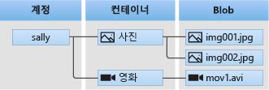

# Education of Week 4

[ 교육 내용 ]

1. **Azure Storage**
   1. Storage Account
      - Blob 및 Files 서비스 위주로 교육 내용을 구성
      - 기본 실습 및 심화 실습 진행
   2. Managed Disk
      - 기본 교육과 실습으로 구성
2. **재해복구**
   1. Azure Backup
   2. Azure Site Recovery

# Azure Storage

## Storage Account

    Storage Accounts는 사용자의 데이터에 대해 Azure 내 유일한 namespace를 제공한다.

### Overview

> - Azure Storage Account는 Blob, Files, Queue, Table, Disk 등 모든 Azure Storage 데이터 개체 포함
> - Storage Account는 HTTP or HTTPS를 통해 전 세계 어디서나 액세스 가능한 고유한 Namespace를 제공

1. Container
   - 개체 데이터를 Block, Page, Append Blob으로 저장하기 위한 서비스
2. 파일 공유
   - SMB 프로토콜을 사용해 컴퓨터에 마운트 할 수 있는 네트워크 저장소
3. Queue
   - 대량의 메시지를 처리하기 위한 FIFO 저장소
4. Tables
   - 테이블 형식의 구조적인 저장소를 제공
   - OData 프로토콜을 구현하는 REST API 제공

> 용어 조사
> 
> Blob, Queue, Namespace, SMB, NFS, FIFO, OData 프로토콜, REST API, 

### 1. Blob (Binary large object)

- DBMS의 하나의 Entity로서 저장되는 binary Data의 모임
- 일반적으로 그림, 오디오 또는 기타 멀디미디어 오브젝트
- 바이너리 실행 코드가 BLOB으로 저장되기도 함.

> Azure Blob Storage는
>
> - 대량의 비정형 데이터를 저장하도록 최적화
> - 다음을 위해 설계
>   - 브라우저에 이미지 또는 문서 직접 제공
>   - 분산 액세스용 파일 저장
>   - 동영상 및 오디오 스트리밍
>   - 로그 파일에 쓰기
>   - 백업/복원, 재해 복구 및 보관용 데이터 저장
>   - On-Prem 또는 Azure hosted service에 의한 분석용 데이터 저장
> - User나 Client Application은 전 세계 어디서든 HTTP/HTTPS를 통해 Blob Storage 개체에 access 가능
>   - Azure Storage REST API, PowerShell, CLI or Azure Storage Client Library 통해 Access 가능

#### **Blob Storage Resource**

Blob Storage 제공 resource 유형

- Storage Account
- Storage Account의 Container
- Container의 BLOB

    

#### **Container**

- blob 모음으로 조절되며 file system에서의 directory와 유사하다.
- Storage account가 가질 수 있는 container 수는 제한이 없고, container는 숫자에 제한 없이 blob을 저장할 수 있다.

#### **Blobs**

    Azure Storage는 3가지 종류의 blobs을 지원한다.

> ### Reference
>
> [[Microsoft Document] Block blob, Append blob 및 Page blob 이해](https://docs.microsoft.com/ko-kr/rest/api/storageservices/understanding-block-blobs--append-blobs--and-page-blobs)

Storage service는 Block, Append, Page type blob을 저장할 수 있으며, 각 Blob을 생성할 때 type을 지정한다. blob이 생성된 후에는 type을 변경할 수 없다.

- Block blob
  - 대용량 데이터의 효율적 업로드에 최적화
  - text & binary data 저장
  - 개별적으로 관리할 수 있는 data block으로 구성
  - block 당 100 MiB, 최대 5만 block, 4.75 TiB까지 저장 가능
- Append blob
  - block blob처럼 block으로 구성되지만 append(이어쓰기) 작업에 최적화되어 있음
  - logging 시나리오에 적합
  - 최대 5만 block
- Page blob
  - 최대 8TiB 크기의 Random Access 파일 저장
  - 512 bytes page collection
  - Random Access Read & Write에 최적화

> ### Reference
>
> [[Microsoft Document] Azure Blob Storage : Hot, Cool 및 Archive Storage tier](https://docs.microsoft.com/ko-kr/azure/storage/blobs/storage-blob-storage-tiers?tabs=azure-portal)

#### **복제** : Storage Account가 복제되는 방법 지정, 기본 복제 옵션 - RA-GRS (읽기 액세스 지역 중복 스토리지)

- Azure Storage는 계획되지 않은 이벤트로부터 데이터를 보호하기 위해 항상 다수의 복사본을 저장
- 기본지역의 중복성 : Azure Storage는 항상 기본 지역에서 3번 복제
  - Azure Storage가 기본 지역에서 데이터를 복제하는 2가지 옵션 존재
    1. LRS (로컬 중복 저장소) 
       - 기본 지역 내 하나의 물리적 위치 내에서 데이터를 동기적으로 3번 복사
       - 가장 저렴한 복제 옵션, High Availability 필요한 경우 권장 X
       - 데이터 센터 내에서 화재나 홍수와 같은 재해가 발생하는 경우 데이터 복구 불가
       - 쓰기 작업은 3개의 모든 복제본에 데이터가 작성된 후에만 성공적으로 반환
       - 데이터가 특정 국가나 지역 내에서만 존재해야 하는 경우 LRS 선택 가능
    2. ZRS (영역 중복 저장소)
       - 기본 지역에 있는 3개의 가용성 영역(Availability Zone)에서 데이터를 동기적으로 복사
       - zone을 사용할 수 없게되면 Azure는 배포한 DNS를 다시 가리키는 등의 네트워킹 업데이트를 진행
       - High Availability 필요한 경우, 마이크로소프트는 기본 지역에서 ZRS 사용하고 보조 지역에도 복제하는 것을 권장
       - 쓰기 작업은 3개의 가용성 영역에서 데이터가 모든 복제본에 작성된 후에만 성공적으로 반환
       - 데이터가 특정 국가나 지역 내에서만 존재해야 하는 경우 ZRS 선택 가능
       - 현재 한국의 경우 Availability Zone을 지원하지 않아 ZRS 선택 불가
  
> ## **`동기`와 `비동기`** : 데이터를 받는 방식
>
> - 동기 (`Synchronous`: 동시에 일어나는)
>
>        요청을 하면 시간이 얼마가 걸리던지, 요청한 자리에서 결과가 주어지는 방식
>
>   - 설계가 간편, 직관적
>
>   - 결과가 주어질 때까지 아무 것도 못하고 대기해야함
> - 비동기 (`Asynchronous` : 동시에 일어나지 않는)
>
>        요청한 그 자리에서 결과가 주어지지 않음
>   - 동기보다 복잡
>   - 결과가 주어지는데 시간이 걸리더라도, 그 시간동안 다른 작업 가능
>
- VM에 대한 Azure Managed Disk를 포함한 Storage Account는 항상 LRS를 사용한다.
  - Azure Unmanaged Disk도 LRS 필요
  - Unmanaged Disk에 대한 Storage Account 생성 가능하지만 비동기 지역에서 복제에 대한 일관성 문제로 권장 X
    - Page blob을 Unmanaged Disk라고도 부름.
  - 참조 : [[Azure Managed Disk의 가격 책정]](https://azure.microsoft.com/ko-kr/pricing/details/managed-disks/)
  
- 보조지역의 중복성 : 기본지역 외, 수백 마일 떨어진 보조 지역에 추가로 복사하도록 선택 가능
  - Storage Account 생성 시 계정에 대한 기본 지역 선택하고, 기본 지역에 따라 쌍을 이루는 보조 지역이 결정되며 보조 지역은 변경 불가
  - 보조 지역에 데이터를 복제하는 2가지 옵션 존재
    1. `GRS` (지역 중복 저장소)
       - LRS를 사용해 기본 지역 내 하나의 물리적 위치 내에서 Data를 동기적으로 3번 복사 후 보조 지역 내 하나의 물리적 위치에 데이터를 비동기적으로 복사
    2. `GZRS` (지역 영역 중복 저장소)
       - ZRS를 사용해 기본 지역 내 3개의 Availability Zone에서 Data를 동기적으로 3번 복사 후 보조 지역 내 하나의 물리적 위치에 데이터를 비동기적으로 복사
  - GRS 또는 GZRS를 사용하는 경우, 보조 지역에 대한 장애 조치(failover)가 없으면 보조 지역의 데이터를 읽기 또는 쓰기 액세스에 사용할 수 없다.
    - 참고 : [[보조 지역에 대한 읽기 권한]](https://docs.microsoft.com/ko-kr/azure/storage/common/storage-redundancy#read-access-to-data-in-the-secondary-region)
    - 보조 지역에 대한 read-access의 경우, 읽기 액세스 지역 중복 저장소(RA-GRS)나 읽기 액세스 지역 중복 저장소(RA-GZRS)를 사용하도록 저장소 계정을 구성
  - 기본 지역을 사용할 수 없는 경우에는 보조 지역에 대해 장애 조치(failover)하도록 선택 가능
    - 장애 조치(failover)가 완료되면 보조 지역은 기본 지역이 되고 데이터 다시 읽고 쓰기 가능 
    - 참고 : [[재해 복구 및 저장소 계정 장애 조치(failover)]](https://docs.microsoft.com/ko-kr/azure/storage/common/storage-disaster-recovery-guidance)

#### **Networking**

- 연결 방법 [[연결 방법에 대한 자세한 정보]](https://docs.microsoft.com/ko-kr/azure/storage/common/storage-network-security)

  - 네트워크 규칙을 통해 Storage Account에 대한 Access 수준 보호 및 제어 가능
  - Storage Account에 대한 Access를 지정된 IP 주소, IP 범위 또는 Azure VNet의 Subnet 목록에서 요청되는 경우로 제한 가능
  - Storage Account에는 인터넷을 통해 접근할 수 있는 Public EndPoint가 있으며, Storage Account에 대한 Private EndPoint도 생성 가능
    - [[Storage Account에 대한 Private EndPoint]](https://docs.microsoft.com/ko-kr/azure/storage/common/storage-private-endpoints)

      > ### **Azure Private Endpoint**
      >
      >     Azure Private Link에 의해 작동하는 Network interface로 사용자와 서비스를 비공개로 안전하게 연결
      >
      > - Storage Account에 대해 방화벽 규칙을 켜면 기본적으로 Azure VNet내에서 작동하는 서비스나 허용된 Public IP 주소에서 들어오는 요청이 아닌 모든 경우에 대해 data 요청 차단됨
      > - 차단되는 요청에는 다른 Azure service, Azure Portal, Logging, Metrics service를 포함
      > - Sevice instance를 hosting하는 subnet의 traffic을 허용시켜야 VNet 내에서 동작하는 Azure service에 대한 Access 권한 부여 가능.

## Managed Disk

# 재해복구

## Azure Backup

## Azure Site Recovery