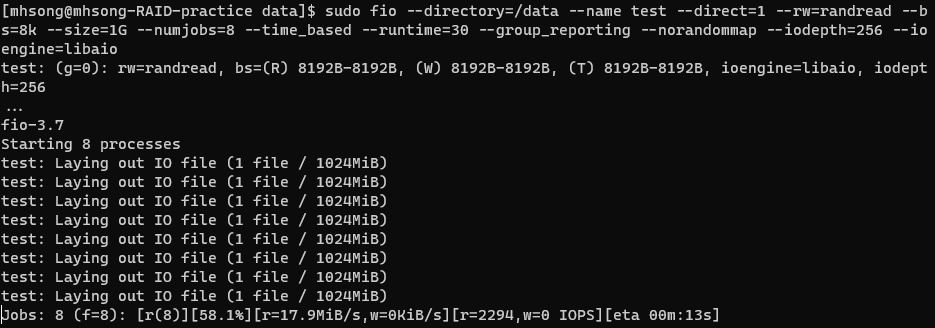

# Azure Storage Disk Lab1

# 상황

```plain
Standard_D2s_v3 크기를 가진 Cent OS 7.5 가상머신의 Data 디스크 영역에 DBMS를 설치했는데 I/O 속도가 부족하다는 연락을 받았다. 자세한 상황을 들어보니 Data disk는 Premium SSD를 1개 쓰고 있고 용량은 250 GiB라고 한다. 약 2000 IOPS정도면 괜찮을 것 같다고 한다.
```

# 조건

- VM Sku : Standard D2s v3
- VM OS : Cent OS 7.5
- Disk IOPS : 2000 IOPS
- Disk 크기 : 250 GiB

<br>

# 문제 해결

1. Sku 변경으로 IOPS 증가
2. RAID 0 구성을 통해 IOPS 증가

<br>

# (Software) RAID 구성

Reference : [Linux에서 Software RAID 구성](https://docs.microsoft.com/ko-kr/previous-versions/azure/virtual-machines/linux/configure-raid#attaching-data-disks)

> **!! Note**
> 서로 다른 크기의 Disk를 섞어서 구성하는 경우, 가장 느린 Disk로 성능이 제한된다.

Work Flow

1. VM 에 Data Disk 붙이기
2. Disk RAID 구성
3. IOPS test (with fio)

<br>

# 1. VM에 Data Disk 붙이기

<br>

## 1.1. VM 생성

<br>

Cent OS 7.5로 Linux VM 생성한다

> - 가상 머신 크기에 따라 연결할 수 있는 Disk의 수 제한이 존재
>   - 참고 : [Dv3 및 Dsv3 시리즈](https://docs.microsoft.com/ko-kr/azure/virtual-machines/dv3-dsv3-series)
> - 가상 머신에 연결된 Disk는 실제 Azure에 저장된 .vhd 파일
>   - 참고 : [Introduction for Managed Disks](https://docs.microsoft.com/ko-kr/azure/virtual-machines/managed-disks-overview?toc=/azure/virtual-machines/linux/toc.json)

<br>

## 1.2. 생성된 VM에 Data Disk 추가하기

<br>


Portal에서 Standard HDD 64 GB 4개 연결한다.

- D2s_v3 VM의 경우 data disk 최대 4개까지 연결 가능
- Standard HDD 64 GB 의 경우 개당 최대 IOPS = 500

<br>

## 1.3. Standard HDD 64 GB 4개 RAID 0 구성하기

<br>

> Reference : [Linux에서 Software RAID 구성](https://docs.microsoft.com/ko-kr/previous-versions/azure/virtual-machines/linux/configure-raid)

<br>

## 1.3.1. Disk 연결 후 `lsblk`를 사용해 disk가 잘 연결되었는지 확인한다.

<br>

```bash
lsblk -o NAME,HCTL,SIZE,MOUNTPOINT | grep -i "sd"
```

## 1.3.2. Partition a new disk

<br>

> Reference : [포털을 사용해 데이터 디스크를 Linux VM에 연결](https://docs.microsoft.com/ko-kr/azure/virtual-machines/linux/attach-disk-portal)

- 기존 디스크 사용 중이라면 디스크 탑재 단계 skip
- 새 디스크를 연결하는 경우, 디스크를 분할

`parted` Utility를 사용해 data disk를 분할하고 형식 지정 가능하다.

> **!! Note**
> - 가장 최신 버전의 `parted`를 사용하는 것이 좋다.
> - Disk 크기 >= 2 TiB, GPT partition 사용해야 함
> - Disk 크기 < 2T TiB, MBR or GPT partition 사용해야 함

다음 예는 sdc disk에 대한 `parted` 사용 예이다.

```bash
sudo parted /dev/sdc --script mklabel gpt mkpart xfspart xfs 0% 100%
sudo mkfs.xfs /dev/sdc1
sudo partprobe /dev/sdc1
```

`partprobe` 사용해 커널이 새 파티션 및 파일 시스템을 인식하는지 확인해본다. `partprobe` 사용에 실패하면 `blkid`나 `lslbk`를 사용했을 때 새 filesystem에 대한 UUID가 즉시 반환되지 않을 수 있다.

---
<br>

# 2. RAID Array 구성

## 2.1. Create RAID Array

<br>

> Reference
> - [[Azure Document] Linux에서 Software RAID 구성](https://docs.microsoft.com/ko-kr/previous-versions/azure/virtual-machines/linux/configure-raid#attaching-data-disks)

1. RAID를 생성할 때 대상 파티션은 mount 되면 안된다.

2. `mdadm`은 Linux에서 Software RAID 구성시키는 프로그램이다.
   - 사용법

     ```bash
     $ sudo mdadm [mode] <raid-device> [options] <component-devices>
     ```

   - 옵션
  
    <center>

    |옵션|설명|
    |:---:|:---:|
    |-C, --create|RAID device 생성|
    |-l, --level|RAID level|
    |-n, --raid-devices|RAID에 설정될 device 개수|
    |-S, --stop|RAID device 작동 중지|
    |-D, --detail|RAID 정보 출력|

    </center>

    <br>

3. 다음 명령을 통해 4개의 파티션을 "Stripe" 한다. (RAID Level 0) Stripe 결과 `/dev/md100` 이라는 새 RAID device가 생성된다. 이 data disk가 이전에 작동하지 않는 다른 RAID Array의 일부였다면, `--force` parameter를 `mdadm` command에 추가해야 한다.

    ```bash
    sudo mdadm --create /dev/md100 --level 0 --raid-devices 4 \
        /dev/sdc1 /dev/sdd1 /dev/sde1 /dev/sdf1
    ```

4. 새 RAID device에서 file system 만들기

    ```bash
    sudo mkfs -t xfs /dev/md100
    ```

5. `mkdir`을 사용해 file system을 mount할 directory를 생성한다.

   - `data` 디렉토리 생성

       ```bash
       sudo mkdir /data
       ```

6. `mount` 를 사용해 filesystem을 mount한다. 다음은 `/dev/md100` partition을 mount point `/data`에 mount 하는 예이다.

   ```bash
   sudo mount /dev/md100 /data
   ```

   - 부팅 후 드라이브가 자동으로 다시 mount되도록 하려면 `/etc/fstab`파일에 추가 필요
  
   - `/etc/fstab`에서 UUID(범용 고유 식별자)를 사용해 장치이름(`/dev/sdc1`)이 아니라 드라이브를 참조하는 것이 좋다.
   - UUID를 확인하기 위해서는 다음 command를 사용한다

        ```bash
        sudo -i blkid
        ```

   - text editor를 사용해 `fstab` 파일을 수정한다.

        ```bash
        sudo vi /etc/fstab
        ```

        `/etc/fstab` 파일 끝에 다음을 추가한다.

        ```bash
        UUID=33333333-3b3b-3c3c-3d3d-3e3e3e3e3e3e   /data   xfs   defaults   0   2
        ```

    > ## **man fstab**
    >   - The fourth field (fs_mntops).
    > 
    >         This field describes the mount options associated with the filesystem. It is formatted as a comma separated list of options. It contains at least the type of mount plus any additional options appropriate to the filesystem type. For  documentation on the available  mount options, see mount(8). For documentation on the available swap options, see swapon(8).
    > 
    >         Basic file system independent options are:
    >
    >           - defaults
    >             use default options: rw, suid, dev, exec, auto, nouser, and async.
    > 
    >           - noauto do not mount when "mount -a" is given (e.g., at boot time)
    >
    >           - user   allow a user to mount
    >
    >           - owner  allow device owner to mount
    > 
    >           - comment
    >                 or x-<name> for use by fstab-maintaining programs
    >
    >           - nofail do not report errors for this device if it does not exist.
    >
    > - The fifth field (fs_freq).
    > 
    >       This field is used for these filesystems by the dump(8) command to determine which filesystems need to be dumped. If the fifth field is not present, a value of zero is returned and dump will assume that the filesystem does not need to be dumped.
    >
    > - The sixth field (fs_passno).
    > 
    >       This field is used by the fsck(8) program to determine the order in which filesystem checks are done at reboot time. The root filesystem should be specified with a fs_passno of 1, and other filesystems should have a fs_passno of 2. Filesystems within a drive will be checked sequentially, but filesystems on different drives will be checked at the same time to utilize parallelism available in the hardware. If the sixth field  is not present or zero, a value of zero is returned and fsck will assume that the filesystem does not need to be checked.

7. `/etc/fstab` 항목이 바른지 테스트한다.

   ```bash
   sudo mount -a
   ```

   위 명령의 결과, 오류 메시지가 발생하는 경우 `/etc/fstab` 파일에서 구문을 확인한다. 이 후 `mount` 명령을 실행해 file system이 탑재되었는지 확인한다.

   ```bash
   mount
   ```

## 3. `fio`를 사용한 IOPS 측정

> ### Reference
> 1. [[Microsoft Document] Disks benchmarks](https://docs.microsoft.com/ko-kr/azure/virtual-machines/windows/disks-benchmarks)
> 2. [Fio Document](https://fio.readthedocs.io/en/latest/fio_doc.html)
> 3. [https://wiki.mikejung.biz/Benchmarking](https://wiki.mikejung.biz/Benchmarking)

### **Fio 란?**

- I/O workload simulation program

### **Parameter**

- bs [bytes] : I/O test에서 작성할 file의 block size
  - Default : 4096 (= 4k)
- numjobs : I/O test에 사용될 job의 clone 수
  - Default : 1
  - 각 clone은 독립적인 thread 또는 process로 생성
- ioengine : I/O test에 사용될 engine 지정
  - Default : Sync I/O engine
- iodepth : test에 사용할 I/O units의 수
  - Synchronous io engine 사용 시, iodepth 값이 1을 초과하는 경우 영향 없음
- direct : `fio`가 I/O를 direct I/O로 진행할 지, buffered I/O로 진행할 지의 여부 지정
  - Default : 0 (= buffered I/O)

### **Test 진행**

- Package Manager를 사용해 `fio` 설치

  ```bash
  sudo yum -y install fio
  ```

- `fio` test (random access read)

  ```bash
  sudo fio --directory=/data --name test --direct=1 --rw=randread --bs=8k --size=1G --numjobs=8 --time_based --runtime=30 --group_reporting --norandommap --iodepth=256 --ioengine=libaio
  ```

  - ioengine = libaio 사용
    - libaio는 Linux native Asynchronous I/O engine
    - IOPS test 진행 시 일반적으로 많이 사용
  - "direct I/O" 를 사용하는 이유
    - Load를 많이 가해서 높은 수준의 IOPS까지 나오는지 확인하기 위함

- `rw=randread` test
  
  

- `rw=randwrite` test
  
  

## 4. RAID 설정 제거

> **Reference** : [mdadm [Seed's Tale]](https://wiki.vlee.kr/doku.php?id=mdadm)

1. `/etc/fstab`에서 RAID device 삭제

2. `umount` command로 RAID device unmount

    ```bash
    sudo umount /dev/md100 /data
    ```

3. RAID 구성 중인 device 종료

   ```bash
   $ sudo mdadm -S /dev/md[Number]
   ```

4. 이 후 RAID 구성에 사용되었던 disk device block을 지정해 superblock metadata 제거

   ```bash
   $ sudo mdadm --zero-superblock /dev/sd[a, b, c ...]
   ```