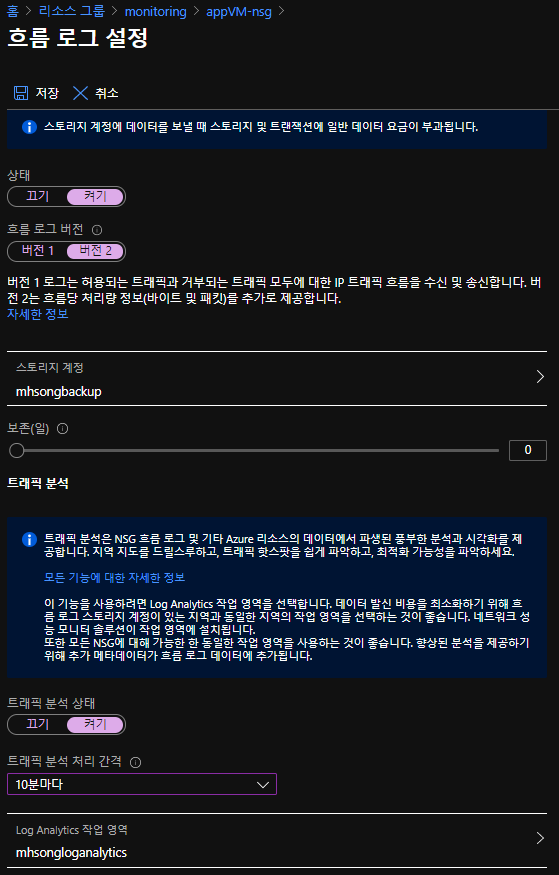
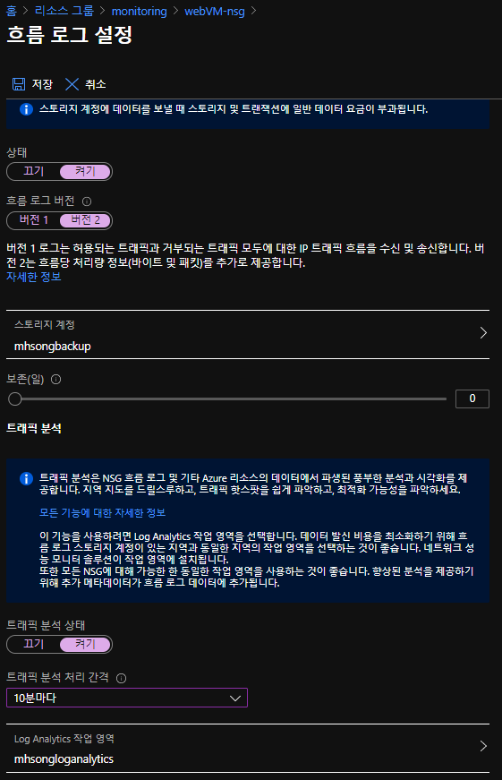

# Lab 1. Azure Monitor 모니터링

## 상황

Azure Monitor를 사용해 인프라 모니터링을 수행한다. 사용하는 리소스는 대부분 가상머신이며 **[웹 서버 - (애플리케이션 서버 + DB 서버)]** 2티어 구조이다. 방화벽은 없고 NSG를 사용해 트래픽 제어를 수행하고 있는 중이다. 따라서 가상머신 현황과 현재 위협적인 공격이 없는지 판단하기 위한 대시보드를 만드려고 한다.

## 기본 조건

1. 가상 머신 두 대 사용 : WEB + APP
   - 웹 서버는 공인 IP 사용, 앱 서버는 공인 IP 없음 : 서브넷 분리 필수
2. NSG 흐름 로그 활성화
   - 모든 Subnet에 NSG 흐름 로그를 활성화 하고 Log Analytics로 데이터 전송하도록 설정
3. 대시보드 작성
   - Azure Portal 메인 페이지 대시보드에 가상머신 메트릭과 NSG 흐름 로그 대시보드 구성
4. 경고 규칙 구성
   - 가상머신 종료, 재부팅, CPU가 70% 이상이면 관리자에게 이메일 발송 설정

## NSG 흐름 로그 활성화

1. Log Analytics workspace 생성
2. 모든 Subnet에서 NSG 흐름 로그 활성화
   - app nsg 흐름 로그 활성화

      

   - web nsg 흐름 로그 활성화

      
3. 대시보드 작성 (데이터 시각화)
   - 대시보드로 데이터를 시각화한다.
   - Reference : [[Microsoft Document] Azure dashboard](https://docs.microsoft.com/ko-kr/azure/azure-monitor/visualizations#azure-dashboards 
)

   - Metrics monitoring
     - 대상 Metrics
        1. VM 평균 CPU Percentage
        2. VM Network In/Out total