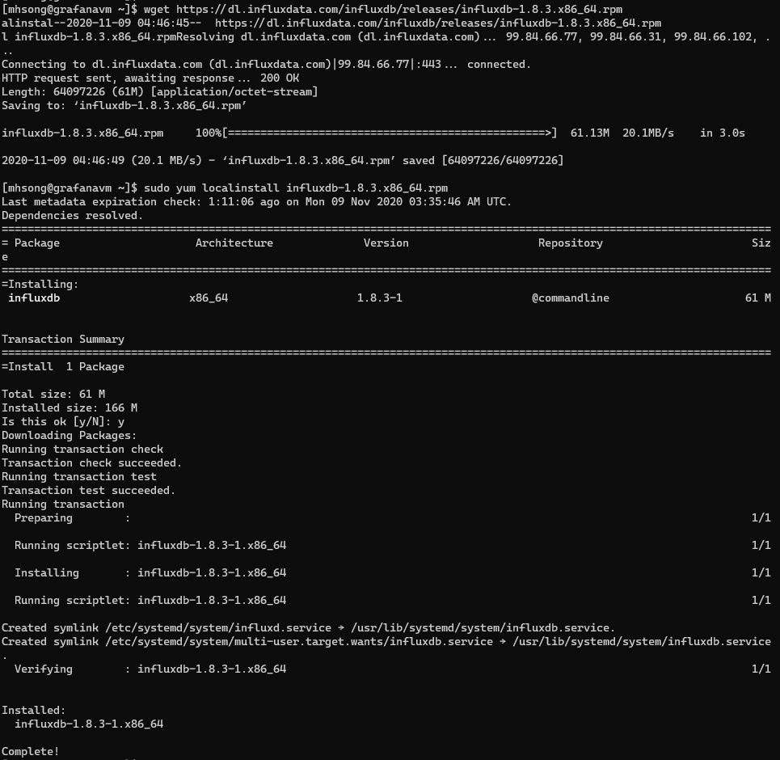
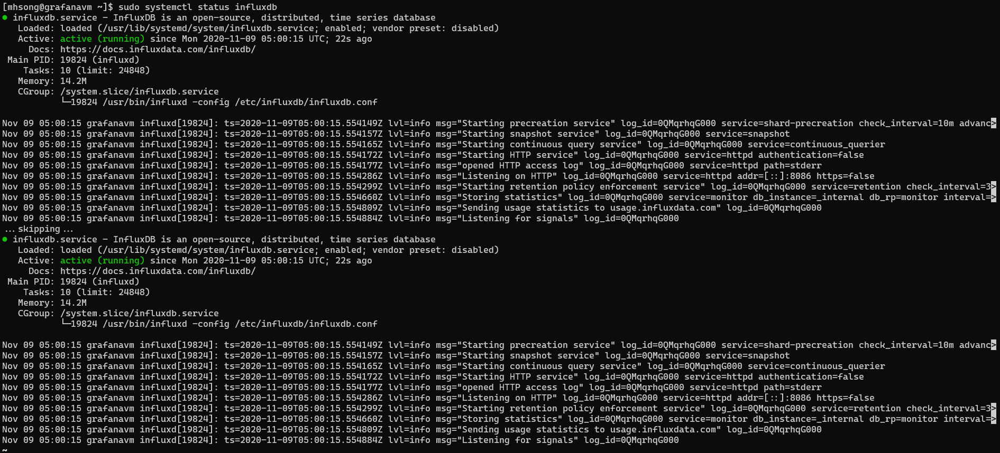
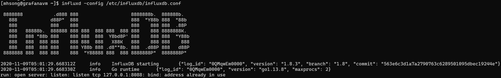
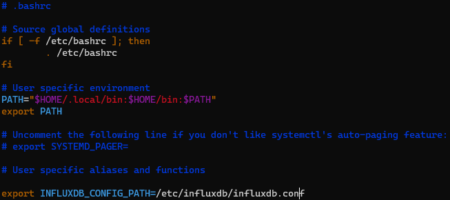
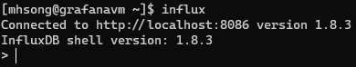
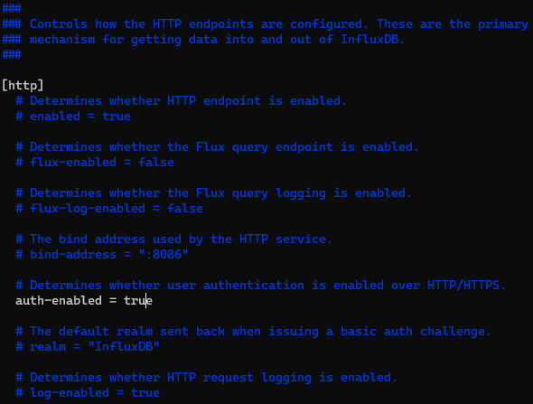

# LAB 3. Telegraf 사용

## 1. InfluxDB 설치

> Reference : [influxDB 1.8.3 Download](https://portal.influxdata.com/downloads/)

다음 command로 1.8.3 버전을 설치한다.

```bash
wget https://dl.influxdata.com/influxdb/releases/influxdb-1.8.3.x86_64.rpm
sudo yum localinstall influxdb-1.8.3.x86_64.rpm
```



### `influxd` daemon 실행

```bash
sudo systemctl start influxd
sudo systemctl status influxd
```



### config 파일 지정

```bash
influxd -config /etc/influxdb/influxdb.conf
```



### 환경 변수 설정

`~/.bashrc`를 편집기로 열어서 아래 내용을 추가한다.

```bash
export INFLUXDB_CONFIG_PATH=/etc/influxdb/influxdb.conf
```



이 후 `source` command로 환경 변수에 추가한다.

```bash
source ~/.bashrc
```

### influxDB CLI 접근

`influxd`는 influxd daemon 실행, `influx`는 CLI에 접근하는 명령이다.



---
### User 생성 및 로그인 활성화

influx CLI환경에서 다음 명령을 통해 User를 생성한다.

```SQL
CREATE USER <username> WITH PASSWORD '<password>' WITH ALL PRIVILEGES
```

이 후 `/etc/influxdb/influxdb.conf` 파일에 `auth-enable=true`로 설정해 로그인 옵션을 활성화 한다.



---

## 2. web VM 과 app VM 에 Telegraf 설치

다음 명령을 통해 Telegraf agent를 webVM과 appVM에 설치한다.

```bash
wget https://dl.influxdata.com/telegraf/releases/telegraf-1.16.1-1.x86_64.rpm
sudo yum localinstall telegraf-1.16.1-1.x86_64.rpm
```

이 후 `systemctl`로 데몬을 구동한다.

## 3. Telegraf Input Plugin

> Reference : [Telegraf Input Plugin Githup](https://github.com/influxdata/telegraf/tree/master/plugins/inputs)