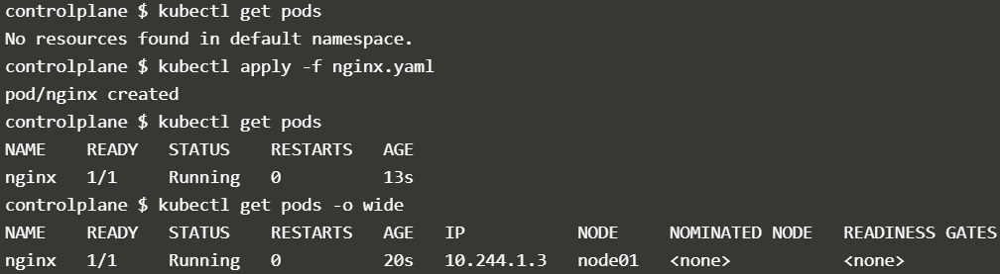
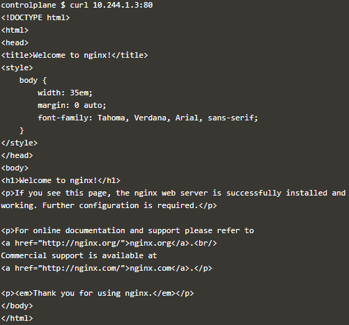
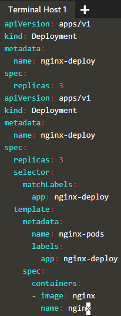
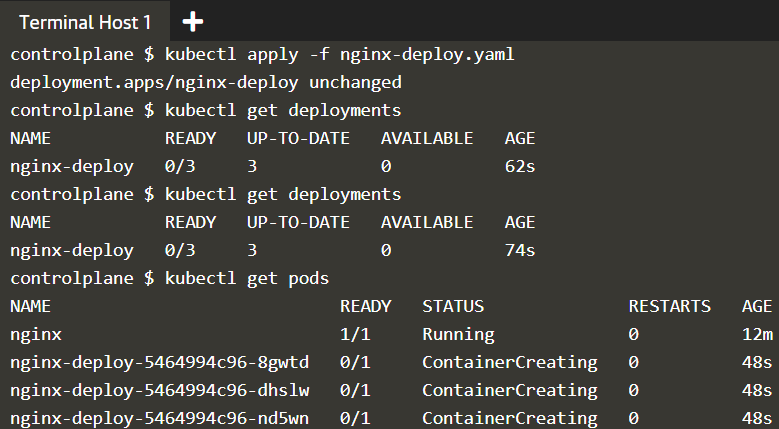
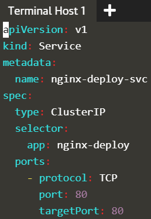
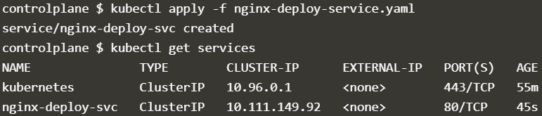
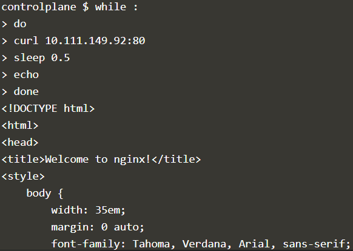
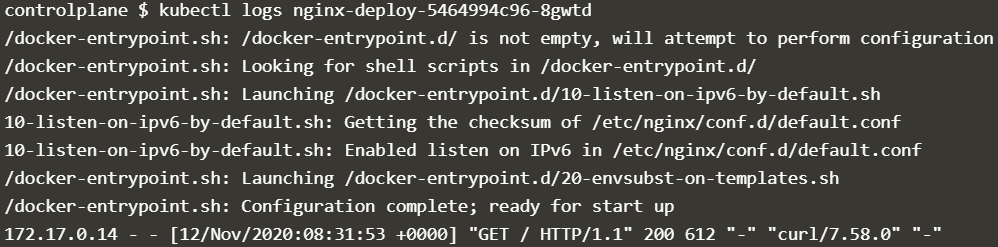
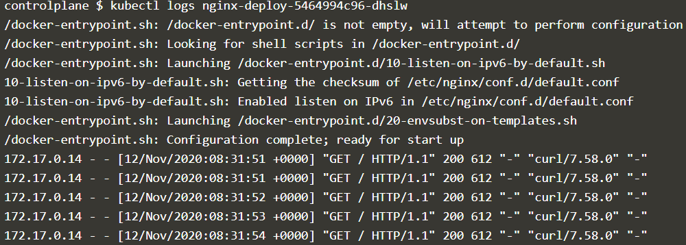
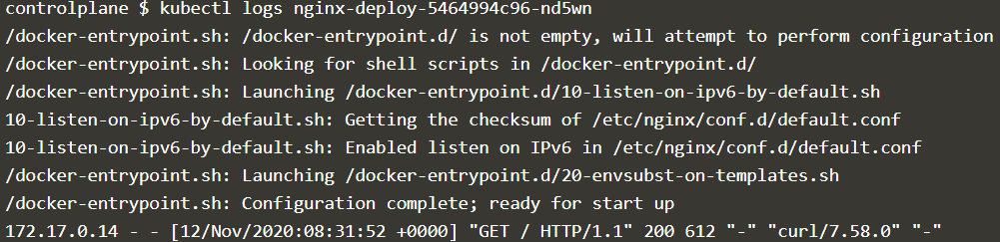

# LAB 2. Kubernetes

> ["katacoda.com"](https://www.katacoda.com/courses/kubernetes/playground) 의 Online terminal에서 진행

## 1. node 상태 확인

`kubectl get nodes` command를 사용해 각 node들이 ready인지 확인한다.

```bash
controlplane $ kubectl get nodes
NAME           STATUS   ROLES    AGE   VERSION
controlplane   Ready    master   18m   v1.18.0
node01         Ready    <none>   18m   v1.18.0
```

## 2. Manifest file 생성

```bash
vim nginx.yaml
```

```yaml
apiVersion: v1
kind: Pod
metadata:
  name: nginx

spec:
  containers:
  - image: nginx
    name: nginx
```

## 3. Pod 배포

```bash
controlplane $ kubectl apply -f nginx.yaml
pod/nginx created

controlplane $ kubectl get pods
NAME    READY   STATUS    RESTARTS   AGE
nginx   1/1     Running   0          3m25s

controlplane $ kubectl get pods -o wide
NAME    READY   STATUS    RESTARTS   AGE     IP           NODE     NOMINATED NODE   READINESS GATES
nginx   1/1     Running   0          4m12s   10.244.1.3   node01   <none>           <none>

controlplane $ curl 10.244.1.3:80
```


```html
<!DOCTYPE html>
<html>
<head>
<title>Welcome to nginx!</title>
<style>
    body {
        width: 35em;
        margin: 0 auto;
        font-family: Tahoma, Verdana, Arial, sans-serif;
    }
</style>
</head>
<body>
<h1>Welcome to nginx!</h1>
<p>If you see this page, the nginx web server is successfully installed and
working. Further configuration is required.</p>

<p>For online documentation and support please refer to
<a href="http://nginx.org/">nginx.org</a>.<br/>
Commercial support is available at
<a href="http://nginx.com/">nginx.com</a>.</p>

<p><em>Thank you for using nginx.</em></p>
</body>
</html>
```



## 4. Multi Replicas를 갖는 Deployment 배포

```bash
controlplane $ vim nginx-deploy.yaml
```

```yaml
apiVersion: apps/v1
kind: Deployment
metadata:
  name: nginx-deploy
spec:
  replicas: 3
  selector:
    matchLabels:
      app: nginx-deploy
  template:
    metadata:
      name: nginx-pods
      labels:
        app: nginx-deploy
    spec:
      containers:
      - image: nginx
        name: nginx 
```



```bash
controlplane $ kubectl apply -f nginx-deploy.yaml
deployment.apps/nginx-deploy created

controlplane $ kubectl get deployments
NAME           READY   UP-TO-DATE   AVAILABLE   AGE
nginx-deploy   3/3     3            3           3m59s

controlplane $ kubectl get pods
NAME                            READY   STATUS    RESTARTS   AGE
nginx                           1/1     Running   0          15m
nginx-deploy-5464994c96-8gwtd   1/1     Running   0          3m30s
nginx-deploy-5464994c96-dhslw   1/1     Running   0          3m30s
nginx-deploy-5464994c96-nd5wn   1/1     Running   0          3m30s
```



## 5. LoadBalacer 달아보기

Kubernetes의 service는 LoadBalancing 기능이 있다. `서비스 타입 = 클러스터 IP`인 서비스를 배포한다.

### 5.1. Menifest file을 생성한다.

```bash
vim nginx-deploy-service.yaml
```

```yaml
apiVersion: v1 

kind: Service
metadata:
  name: nginx-deploy-svc
spec:
  type: ClusterIP
  selector:
    app: nginx-deploy
  ports:
    - protocol: TCP
      port: 80
      targetPort: 80
```



### 5.2. 작성한 yaml 파일로 ClusterIP type Service 배포

```bash
kubectl apply -f nginx-deploy-service.yaml
service/nginx-deploy-svc create
```

```bash
NAME                            READY   STATUS    RESTARTS   AGE
nginx                           1/1     Running   0          15m
nginx-deploy-5464994c96-8gwtd   1/1     Running   0          3m30s
nginx-deploy-5464994c96-dhslw   1/1     Running   0          3m30s
nginx-deploy-5464994c96-nd5wn   1/1     Running   0          3m30s

controlplane $ vim nginx-deploy-service.yaml
controlplane $ kubectl apply -f nginx-deploy-service.yaml
service/nginx-deploy-svc created

controlplane $ kubectl get services
NAME               TYPE        CLUSTER-IP      EXTERNAL-IP   PORT(S)   AGE
kubernetes         ClusterIP   10.96.0.1       <none>        443/TCP   55m
nginx-deploy-svc   ClusterIP   10.111.149.92   <none>        80/TCP    45s
```



### 5.3. Service의 LoadBalancing 검증

shell script while 문으로 `curl <ClusterIP의 IP>:80` 을 반복시킨 후 각 Pods의 log를 출력해 접속기록을 확인하는 방식으로 LoadBalancing이 수행되는지를 검증했다.

```bash
controlplane $ while :
> do
> curl 10.111.149.92:80
> sleep 0.5
> echo
> done
<!DOCTYPE html>
<html>
<head>
<title>Welcome to nginx!</title>
<style>
    body {
        width: 35em;
        margin: 0 auto;
        font-family: Tahoma, Verdana, Arial, sans-serif;
    }
</style>
</head>
<body>
<h1>Welcome to nginx!</h1>
<p>If you see this page, the nginx web server is successfully installed and
working. Further configuration is required.</p>

<p>For online documentation and support please refer to
<a href="http://nginx.org/">nginx.org</a>.<br/>
Commercial support is available at
<a href="http://nginx.com/">nginx.com</a>.</p>

<p><em>Thank you for using nginx.</em></p>
</body>
</html>

...
```



```bash
controlplane $ kubectl logs nginx-deploy-5464994c96-8gwtd
/docker-entrypoint.sh: /docker-entrypoint.d/ is not empty, will attempt to perform configuration
/docker-entrypoint.sh: Looking for shell scripts in /docker-entrypoint.d/
/docker-entrypoint.sh: Launching /docker-entrypoint.d/10-listen-on-ipv6-by-default.sh
10-listen-on-ipv6-by-default.sh: Getting the checksum of /etc/nginx/conf.d/default.conf
10-listen-on-ipv6-by-default.sh: Enabled listen on IPv6 in /etc/nginx/conf.d/default.conf
/docker-entrypoint.sh: Launching /docker-entrypoint.d/20-envsubst-on-templates.sh
/docker-entrypoint.sh: Configuration complete; ready for start up
172.17.0.14 - - [12/Nov/2020:08:31:53 +0000] "GET / HTTP/1.1" 200 612 "-" "curl/7.58.0" "-"

controlplane $ kubectl logs nginx-deploy-5464994c96-dhslw
/docker-entrypoint.sh: /docker-entrypoint.d/ is not empty, will attempt to perform configuration
/docker-entrypoint.sh: Looking for shell scripts in /docker-entrypoint.d/
/docker-entrypoint.sh: Launching /docker-entrypoint.d/10-listen-on-ipv6-by-default.sh
10-listen-on-ipv6-by-default.sh: Getting the checksum of /etc/nginx/conf.d/default.conf
10-listen-on-ipv6-by-default.sh: Enabled listen on IPv6 in /etc/nginx/conf.d/default.conf
/docker-entrypoint.sh: Launching /docker-entrypoint.d/20-envsubst-on-templates.sh
/docker-entrypoint.sh: Configuration complete; ready for start up
172.17.0.14 - - [12/Nov/2020:08:31:51 +0000] "GET / HTTP/1.1" 200 612 "-" "curl/7.58.0" "-"
172.17.0.14 - - [12/Nov/2020:08:31:51 +0000] "GET / HTTP/1.1" 200 612 "-" "curl/7.58.0" "-"
172.17.0.14 - - [12/Nov/2020:08:31:52 +0000] "GET / HTTP/1.1" 200 612 "-" "curl/7.58.0" "-"
172.17.0.14 - - [12/Nov/2020:08:31:53 +0000] "GET / HTTP/1.1" 200 612 "-" "curl/7.58.0" "-"
172.17.0.14 - - [12/Nov/2020:08:31:54 +0000] "GET / HTTP/1.1" 200 612 "-" "curl/7.58.0" "-"

controlplane $ kubectl logs nginx-deploy-5464994c96-nd5wn
/docker-entrypoint.sh: /docker-entrypoint.d/ is not empty, will attempt to perform configuration
/docker-entrypoint.sh: Looking for shell scripts in /docker-entrypoint.d/
/docker-entrypoint.sh: Launching /docker-entrypoint.d/10-listen-on-ipv6-by-default.sh
10-listen-on-ipv6-by-default.sh: Getting the checksum of /etc/nginx/conf.d/default.conf
10-listen-on-ipv6-by-default.sh: Enabled listen on IPv6 in /etc/nginx/conf.d/default.conf
/docker-entrypoint.sh: Launching /docker-entrypoint.d/20-envsubst-on-templates.sh
/docker-entrypoint.sh: Configuration complete; ready for start up
172.17.0.14 - - [12/Nov/2020:08:31:52 +0000] "GET / HTTP/1.1" 200 612 "-" "curl/7.58.0" "-"
```

shell script while 문으로 `curl <ClusterIP의 IP>:80` 을 반복시킨 후 각 Pods의 log를 출력해 접속기록을 확인하는 방식으로 LoadBalancing이 수행되는지를 검증했다.





