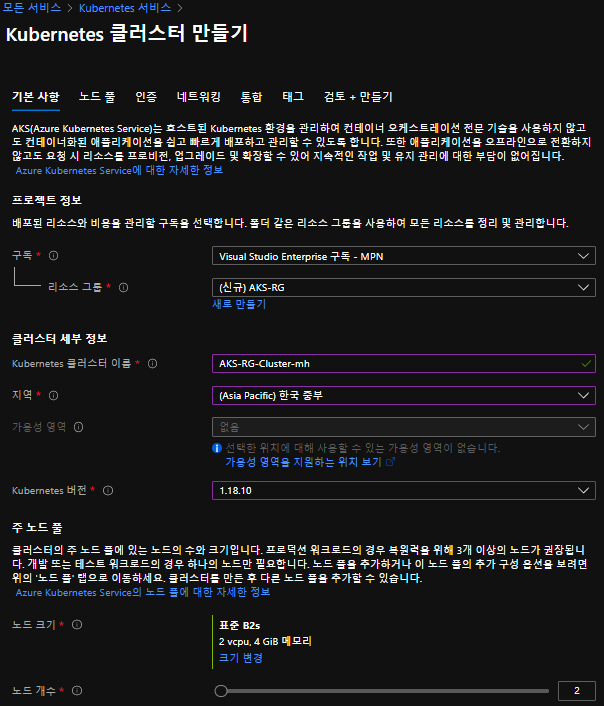
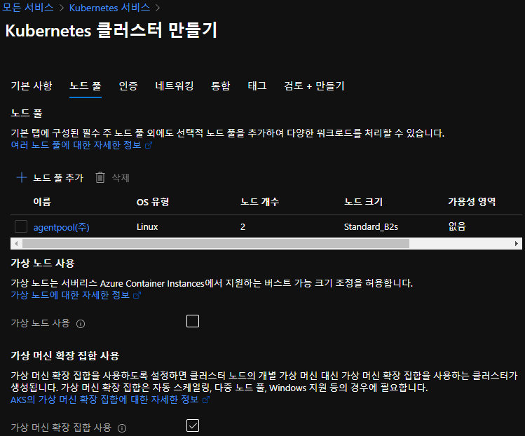
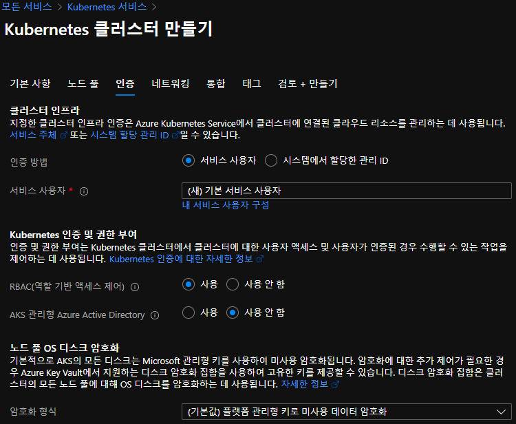
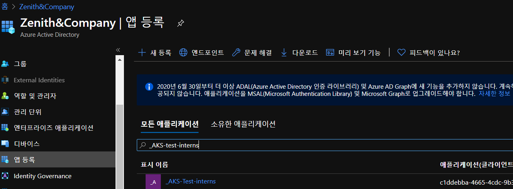
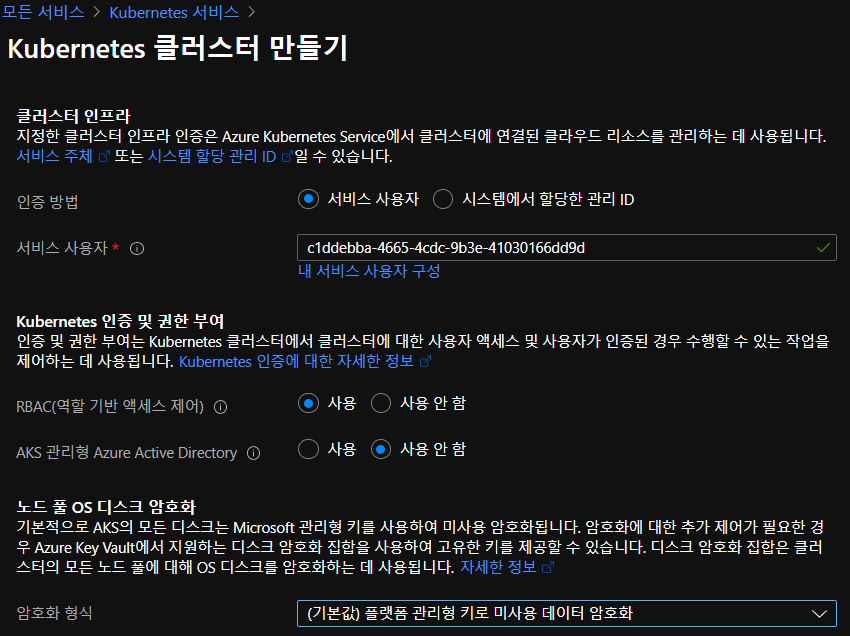

# LAB 3. AKS

## 1. AKS 

### 1.1. AKS Clster 생성








- `Azure Active Directory`에서 기존 항목의 값을 가져온다.
  - `Azure AD`의 앱(`_AKS-test-intern`)의 Client ID, Password 가져옴

    

    ```plain
    Id : c1ddebba-4665-4cdc-9b3e-41030166dd9d
    pw : _o1zG2Zu0HA_Z-eAJ9~6-W~_uf89NEfC8~
    rg : AKS_Dev
    rn : AKS-Dev
    ```

- 인증부 구성 설정 완료 화면
  
  
PS C:\Users\user> ssh mhsong@20.194.39.22

mhsong@20.194.39.22's password:

Activate the web console with: systemctl enable --now cockpit.socket

Last login: Wed Nov 11 00:24:02 2020 from 123.141.145.23

```bash
[mhsong@dockerJumpBox ~]$ ssh mhsong@10.1.0.4
```

```plain
mhsong@10.1.0.4's password:
Activate the web console with: systemctl enable --now cockpit.socket
Last login: Wed Nov 11 00:24:16 2020 from 10.1.0.6
```

```bash
[mhsong@dockerVM1 ~]
$ sudo curl -L "https://github.com/docker/compose/releases/download/1.27.4/docker-compose-$(uname -s)-$(uname -m)" -o /usr/local/bin/docker-compose
```

|%|Total|%|Received|%|Xferd|Average|Speed|Time|Time|Time|Current|
|:---:|:---:|:---:|:---:|:---:|:---:|:---:|:---:|:---:|:---:|:---:|:---:|
|||||||Dload|Upload|Total|Spent|Left|Speed|
|100|651|100|651|0|0|21700|0| --:--:-- | --:--:-- | --:--:-- |21700|
|100|11.6M|100|11.6M|0|0|4378k|0|0:00:02|0:00:02|--:--:--|5249k|

```bash
[mhsong@dockerVM1 ~] $ sudo chmod +x /usr/local/bin/docker-compose
```

```bash
[mhsong@dockerVM1 ~]$ docker-compose version
```

```bash
docker-compose version 1.27.4, build 40524192
docker-py version: 4.3.1
CPython version: 3.7.7
OpenSSL version: OpenSSL 1.1.0l  10 Sep 2019
```

```bash
[mhsong@dockerVM1 ~]
$ sudo rpm --import https://packages.microsoft.com/keys/microsoft.asc
```

```bash
[mhsong@dockerVM1 ~]$ sudo sh -c 'echo -e "[azure-cli] \
name=Azure CLI \
baseurl=https://packages.microsoft.com/yumrepos/azure-cli \
enabled=1 \
gpgcheck=1 \
gpgkey=https://packages.microsoft.com/keys/microsoft.asc" > /etc/yum.repos.d/azure-cli.repo'
```

```bash
[mhsong@dockerVM1 ~]$ sudo yum install azure-cli
```

```bash
[mhsong@dockerVM1 ~]$ sudo az aks install-cli
```

```bash
[mhsong@dockerVM1 ~]$ az login
```

```bash
[mhsong@dockerVM1 ~]$ az account set --subscription 917428f7-be1f-4e78-898e-bf25497ced6a
[mhsong@dockerVM1 ~]$ az account show
[mhsong@dockerVM1 ~]$ az account list
```

```json
[
  {
    "cloudName": "AzureCloud",
    "homeTenantId": "785087ba-1e72-4e7d-b1d1-4a9639137a66",
    "id": "917428f7-be1f-4e78-898e-bf25497ced6a",
    "isDefault": true,
    "managedByTenants": [],
    "name": "Visual Studio Enterprise 구독 - MPN",
    "state": "Enabled",
    "tenantId": "785087ba-1e72-4e7d-b1d1-4a9639137a66",
    "user": {
      "name": "mhsong01@zenithn.com",
      "type": "user"
    }
  }
]
```

```bash
[mhsong@dockerVM1 ~]$ az aks get-credentials -n AKS-Dev -g AKS_Dev

Merged "AKS-Dev" as current context in /home/mhsong/.kube/config

[mhsong@dockerVM1 ~]$ cd .kube/
[mhsong@dockerVM1 .kube]$ ll

total 12
-rw-------. 1 mhsong mhsong 9558 Nov 11 05:58 config

[mhsong@dockerVM1 .kube]$ cd ~
[mhsong@dockerVM1 ~]$ mkdir kube_workshop
[mhsong@dockerVM1 ~]$ cd kube_workshop/
[mhsong@dockerVM1 kube_workshop]$ pwd

/home/mhsong/kube_workshop

[mhsong@dockerVM1 kube_workshop]$ sudo yum -y install git
[mhsong@dockerVM1 kube_workshop]$ git clone https://github.com/Azure-Samples/azure-voting-app-redis.git
[mhsong@dockerVM1 kube_workshop]$ ll

total 0
drwxrwxr-x. 5 mhsong mhsong 177 Nov 11 06:04 azure-voting-app-redis

[mhsong@dockerVM1 kube_workshop]$ cd azure-voting-app-redis/
[mhsong@dockerVM1 azure-voting-app-redis]$ ll
total 16
drwxrwxr-x. 3 mhsong mhsong  128 Nov 11 06:04 azure-vote
-rw-rw-r--. 1 mhsong mhsong 1532 Nov 11 06:04 azure-vote-all-in-one-redis.yaml
-rw-rw-r--. 1 mhsong mhsong  433 Nov 11 06:04 docker-compose.yaml
drwxrwxr-x. 2 mhsong mhsong   59 Nov 11 06:04 jenkins-tutorial
-rw-rw-r--. 1 mhsong mhsong 1162 Nov 11 06:04 LICENSE
-rw-rw-r--. 1 mhsong mhsong 1806 Nov 11 06:04 README.md

[mhsong@dockerVM1 azure-voting-app-redis]$ cat docker-compose.yaml
```

```yaml
version: '3'
services:
  azure-vote-back:
    image: mcr.microsoft.com/oss/bitnami/redis:6.0.8
    container_name: azure-vote-back
    environment:
      ALLOW_EMPTY_PASSWORD: "yes"
    ports:
        - "6379:6379"

  azure-vote-front:
    build: ./azure-vote
    image: mcr.microsoft.com/azuredocs/azure-vote-front:v1
    container_name: azure-vote-front
    environment:
      REDIS: azure-vote-back
    ports:
        - "8080:80"
```

```bash
[mhsong@dockerVM1 azure-voting-app-redis]$ docker-compose
Define and run multi-container applications with Docker.

Usage:
  docker-compose [-f <arg>...] [options] [--] [COMMAND] [ARGS...]
  docker-compose -h|--help

Options:
  -f, --file FILE             Specify an alternate compose file
                              (default: docker-compose.yml)

[mhsong@dockerVM1 azure-voting-app-redis]$ docker-compose up -d

WARNING: The Docker Engine you're using is running in swarm mode.

Compose does not use swarm mode to deploy services to multiple nodes in a swarm. All containers will be scheduled on the current node.

To deploy your application across the swarm, use `docker stack deploy`.

Creating network "azure-voting-app-redis_default" with the default driver
Pulling azure-vote-back (mcr.microsoft.com/oss/bitnami/redis:6.0.8)...
6.0.8: Pulling from oss/bitnami/redis
58212c1109c5: Pull complete
476959f86aed: Pull complete
e9439c5c5ef5: Pull complete
bf887c7f6b15: Pull complete
4e934f6d99d2: Pull complete
e33ec5243c54: Pull complete
9f99ff6b922f: Pull complete
097294963657: Pull complete
919efe137172: Pull complete
b3346fcea345: Pull complete
3bb7743413aa: Pull complete
Digest: sha256:9b53ae0f1cf3f7d7854584c8b7c5a96fe732c48d504331da6c00f892fdcce102
Status: Downloaded newer image for mcr.microsoft.com/oss/bitnami/redis:6.0.8
Building azure-vote-front
Step 1/3 : FROM tiangolo/uwsgi-nginx-flask:python3.6
python3.6: Pulling from tiangolo/uwsgi-nginx-flask
90fe46dd8199: Pull complete
35a4f1977689: Pull complete
bbc37f14aded: Pull complete
74e27dc593d4: Pull complete
4352dcff7819: Pull complete
1847e662e737: Pull complete
11d40aa4a4d0: Pull complete
423a225c2f8b: Pull complete
730abf0e8db7: Pull complete
2f2c1f99caec: Pull complete
117b2bb6b9f5: Pull complete
24cf85cbbf19: Pull complete
e5b1d4c157be: Pull complete
41ed8631c488: Pull complete
4cea017a23a1: Pull complete
634fcb400bb1: Pull complete
751c69d0afb6: Pull complete
d5a08367e03a: Pull complete
d9cd7fb23581: Pull complete
f81f7e2c0189: Pull complete
cd58b8e863a0: Pull complete
509a744cedbf: Pull complete
fa7e0b384c56: Pull complete
5e741e7fd668: Pull complete
ba3119aded00: Pull complete
4ff97eb414d1: Pull complete
Digest: sha256:806a54891bddfe2ffacaa224550ab93b38402e497b6bc96870f8af752c744c6d
Status: Downloaded newer image for tiangolo/uwsgi-nginx-flask:python3.6
 ---> a16ce562e863
Step 2/3 : RUN pip install redis
 ---> Running in 0fe2ac5cf8ff
Collecting redis
  Downloading redis-3.5.3-py2.py3-none-any.whl (72 kB)
Installing collected packages: redis
Successfully installed redis-3.5.3
WARNING: You are using pip version 20.1; however, version 20.2.4 is available.
You should consider upgrading via the '/usr/local/bin/python -m pip install --upgrade pip' command.
Removing intermediate container 0fe2ac5cf8ff
 ---> aad93c6b320d
Step 3/3 : ADD /azure-vote /app
 ---> a954e44b7ccd

Successfully built a954e44b7ccd
Successfully tagged mcr.microsoft.com/azuredocs/azure-vote-front:v1
WARNING: Image for service azure-vote-front was built because it did not already exist. To rebuild this image you must use `docker-compose build` or `docker-compose up --build`.
Creating azure-vote-back  ... done
Creating azure-vote-front ... done

[mhsong@dockerVM1 azure-voting-app-redis]$ docker ps
CONTAINER ID        IMAGE                                             COMMAND                  CREATED             STATUS              PORTS                           NAMES
b4390bdd1fa4        mcr.microsoft.com/azuredocs/azure-vote-front:v1   "/entrypoint.sh /sta…"   4 minutes ago       Up 4 minutes        443/tcp, 0.0.0.0:8080->80/tcp   azure-vote-front
89da436945f6        mcr.microsoft.com/oss/bitnami/redis:6.0.8         "/opt/bitnami/script…"   4 minutes ago       Up 4 minutes        0.0.0.0:6379->6379/tcp          azure-vote-back
39aa57994567        mhsong55/node-host:v0.1                           "docker-entrypoint.s…"   20 minutes ago      Up 20 minutes       3000/tcp                        node-host.3.bb0gftl6qql9phuea75heetz6
ee5139690a9c        mhsong55/node-host:v0.1                           "docker-entrypoint.s…"   20 minutes ago      Up 20 minutes       3000/tcp                        node-host.1.clk06yu431rhdem31brp7fna0
bbe39211d812        mhsong55/node-host:v0.1                           "docker-entrypoint.s…"   20 minutes ago      Up 20 minutes       3000/tcp                        node-host.2.q7wmrifrhecyg4ryffeoxmxtc
[mhsong@dockerVM1 azure-voting-app-redis]$ curl localhost:8080
```

```html
<!DOCTYPE html>
<html xmlns="http://www.w3.org/1999/xhtml">
<head>
    <link rel="stylesheet" type="text/css" href="/static/default.css">
    <title>Azure Voting App</title>

    <script language="JavaScript">
        function send(form){
        }
    </script>

</head>
<body>
    <div id="container">
        <form id="form" name="form" action="/"" method="post"><center>
        <div id="logo">Azure Voting App</div>
        <div id="space"></div>
        <div id="form">
        <button name="vote" value="Cats" onclick="send()" class="button button1">Cats</button>
        <button name="vote" value="Dogs" onclick="send()" class="button button2">Dogs</button>
        <button name="vote" value="reset" onclick="send()" class="button button3">Reset</button>
        <div id="space"></div>
        <div id="space"></div>
        <div id="results"> Cats - 0 | Dogs - 0 </div>
        </form>
        </div>
    </div>
</body>
</html>
```

```bash
[mhsong@dockerVM1 azure-voting-app-redis]$ docker-compose down
Stopping azure-vote-front ... done
Stopping azure-vote-back  ... done
Removing azure-vote-front ... done
Removing azure-vote-back  ... done
Removing network azure-voting-app-redis_default
[mhsong@dockerVM1 azure-voting-app-redis]$ docker logout
Removing login credentials for https://index.docker.io/v1/
[mhsong@dockerVM1 azure-voting-app-redis]$ docker login smhaksdev.azurecr.io
Username: smhaksdev
Password:
WARNING! Your password will be stored unencrypted in /home/mhsong/.docker/config.json.
Configure a credential helper to remove this warning. See
https://docs.docker.com/engine/reference/commandline/login/#credentials-store

Login Succeeded
[mhsong@dockerVM1 azure-voting-app-redis]$ docker images
REPOSITORY                                     TAG                 IMAGE ID            CREATED             SIZE
mcr.microsoft.com/azuredocs/azure-vote-front   v1                  a954e44b7ccd        19 minutes ago      944MB
mhsong55/node-host                             v0.1                9cf0a56946a3        24 hours ago        918MB
nginx                                          latest              c39a868aad02        5 days ago          133MB
node                                           12                  1f560ce4ce7e        4 weeks ago         918MB
mcr.microsoft.com/oss/bitnami/redis            6.0.8               3a54a920bb6c        6 weeks ago         103MB
tiangolo/uwsgi-nginx-flask                     python3.6           a16ce562e863        2 months ago        944MB
[mhsong@dockerVM1 azure-voting-app-redis]$ docker push mcr.microsoft.com/azuredocs/azure-vote-front:v1
The push refers to repository [mcr.microsoft.com/azuredocs/azure-vote-front]
811fb563ec87: Preparing
e6c5ec3a8fb0: Preparing
1971b933c82a: Preparing
596464cb926b: Preparing
07289a4a4d58: Preparing
4249ef06ae69: Waiting
e775b278161a: Waiting
27d9a6169c9f: Waiting
b9557a3d31d9: Waiting
c8f52965417f: Waiting
9cde96ca61c2: Waiting
f3fd11fd6d6c: Waiting
e553743c668b: Waiting
88af765ea71f: Waiting
b47c358499df: Waiting
cbd550635f44: Waiting
2efef025159b: Waiting
3acbf6947195: Waiting
f90fe4978ca2: Waiting
88383b8e3cb5: Waiting
e93627dfc607: Waiting
8f23b00cc77f: Waiting
cf691a2ea3f9: Waiting
3d3e92e98337: Waiting
8967306e673e: Waiting
9794a3b3ed45: Waiting
5f77a51ade6a: Waiting
e40d297cf5f8: Waiting
error parsing HTTP 403 response body: invalid character '<' looking for beginning of value: "<html>\r\n<head><title>403 Forbidden</title></head>\r\n<body bgcolor=\"white\">\r\n<center><h1>403 Forbidden</h1></center>\r\n<hr><center>openresty</center>\r\n</body>\r\n</html>\r\n"
[mhsong@dockerVM1 azure-voting-app-redis]$ docker images
REPOSITORY                                     TAG                 IMAGE ID            CREATED             SIZE
mcr.microsoft.com/azuredocs/azure-vote-front   v1                  a954e44b7ccd        21 minutes ago      944MB
mhsong55/node-host                             v0.1                9cf0a56946a3        24 hours ago        918MB
nginx                                          latest              c39a868aad02        5 days ago          133MB
node                                           12                  1f560ce4ce7e        4 weeks ago         918MB
mcr.microsoft.com/oss/bitnami/redis            6.0.8               3a54a920bb6c        6 weeks ago         103MB
tiangolo/uwsgi-nginx-flask                     python3.6           a16ce562e863        2 months ago        944MB
[mhsong@dockerVM1 azure-voting-app-redis]$ docker tag mcr.microsoft.com/azuredocs/azure-vote-front:v1 \
> smhaksdev.azurecr.io/azure-vote-front:v1
[mhsong@dockerVM1 azure-voting-app-redis]$ docker images
REPOSITORY                                     TAG                 IMAGE ID            CREATED             SIZE
smhaksdev.azurecr.io/azure-vote-front          v1                  a954e44b7ccd        22 minutes ago      944MB
mcr.microsoft.com/azuredocs/azure-vote-front   v1                  a954e44b7ccd        22 minutes ago      944MB
mhsong55/node-host                             v0.1                9cf0a56946a3        24 hours ago        918MB
nginx                                          latest              c39a868aad02        5 days ago          133MB
node                                           12                  1f560ce4ce7e        4 weeks ago         918MB
mcr.microsoft.com/oss/bitnami/redis            6.0.8               3a54a920bb6c        6 weeks ago         103MB
tiangolo/uwsgi-nginx-flask                     python3.6           a16ce562e863        2 months ago        944MB
[mhsong@dockerVM1 azure-voting-app-redis]$ docker push smhaksdev.azurecr.io/azure-vote-front:v1
The push refers to repository [smhaksdev.azurecr.io/azure-vote-front]
811fb563ec87: Pushed
e6c5ec3a8fb0: Pushed
1971b933c82a: Pushed
596464cb926b: Pushed
07289a4a4d58: Pushed
4249ef06ae69: Pushed
e775b278161a: Pushed
27d9a6169c9f: Pushed
b9557a3d31d9: Pushed
c8f52965417f: Pushed
9cde96ca61c2: Pushed
f3fd11fd6d6c: Pushed
e553743c668b: Pushed
88af765ea71f: Pushed
b47c358499df: Pushed
cbd550635f44: Pushed
2efef025159b: Pushed
3acbf6947195: Pushed
f90fe4978ca2: Pushed
88383b8e3cb5: Pushed
e93627dfc607: Pushed
8f23b00cc77f: Pushed
cf691a2ea3f9: Pushed
3d3e92e98337: Pushed
8967306e673e: Pushed
9794a3b3ed45: Pushed
5f77a51ade6a: Pushed
e40d297cf5f8: Pushed
v1: digest: sha256:9c9e98a71b950716dcb113b885aebdf28e406997c30f44c77e6c04116607e0da size: 6175
[mhsong@dockerVM1 azure-voting-app-redis]$ history | grep "az aks"
  166  az aks install-cli
  167  sudo az aks install-cli
  172  az aks get-credentials -n AKS-Dev -g AKS_Dev
  200  history | grep "az aks"
[mhsong@dockerVM1 azure-voting-app-redis]$ az aks update -n AKS-Dev -g AKS_Dev --attach-acr smhaksdev
```

```json
{- Finished ..
  "aadProfile": null,
  "addonProfiles": {
    "KubeDashboard": {
      "config": null,
      "enabled": false,
      "identity": null
    },
    "azurePolicy": {
      "config": null,
      "enabled": false,
      "identity": null
    },
    "httpApplicationRouting": {
      "config": null,
      "enabled": false,
      "identity": null
    }
  },
  "agentPoolProfiles": [
    {
      "availabilityZones": null,
      "count": 2,
      "enableAutoScaling": null,
      "enableNodePublicIp": null,
      "maxCount": null,
      "maxPods": 110,
      "minCount": null,
      "mode": "System",
      "name": "agentpool",
      "nodeImageVersion": "AKSUbuntu-1804-2020.10.21",
      "nodeLabels": {},
      "nodeTaints": null,
      "orchestratorVersion": "1.18.10",
      "osDiskSizeGb": 128,
      "osDiskType": "Managed",
      "osType": "Linux",
      "powerState": {
        "code": "Running"
      },
      "provisioningState": "Succeeded",
      "proximityPlacementGroupId": null,
      "scaleSetEvictionPolicy": null,
      "scaleSetPriority": null,
      "spotMaxPrice": null,
      "tags": null,
      "type": "VirtualMachineScaleSets",
      "upgradeSettings": null,
      "vmSize": "Standard_B2s",
      "vnetSubnetId": "/subscriptions/917428f7-be1f-4e78-898e-bf25497ced6a/resourceGroups/AKS_Dev/providers/Microsoft.Network/virtualNetworks/AKS_Dev-vnet/subnets/default"
    }
  ],
  "apiServerAccessProfile": {
    "authorizedIpRanges": null,
    "enablePrivateCluster": false
  },
  "autoScalerProfile": null,
  "diskEncryptionSetId": null,
  "dnsPrefix": "AKS-Dev-dns",
  "enablePodSecurityPolicy": null,
  "enableRbac": true,
  "fqdn": "aks-dev-dns-0e5ad6e6.hcp.koreacentral.azmk8s.io",
  "id": "/subscriptions/917428f7-be1f-4e78-898e-bf25497ced6a/resourcegroups/AKS_Dev/providers/Microsoft.ContainerService/managedClusters/AKS-Dev",
  "identity": null,
  "identityProfile": null,
  "kubernetesVersion": "1.18.10",
  "linuxProfile": null,
  "location": "koreacentral",
  "maxAgentPools": 10,
  "name": "AKS-Dev",
  "networkProfile": {
    "dnsServiceIp": "100.0.0.10",
    "dockerBridgeCidr": "172.17.0.1/16",
    "loadBalancerProfile": {
      "allocatedOutboundPorts": null,
      "effectiveOutboundIps": [
        {
          "id": "/subscriptions/917428f7-be1f-4e78-898e-bf25497ced6a/resourceGroups/MC_AKS_Dev_AKS-Dev_koreacentral/providers/Microsoft.Network/publicIPAddresses/3faf5883-27f7-45fc-a0c7-48e313365cd6",
          "resourceGroup": "MC_AKS_Dev_AKS-Dev_koreacentral"
        }
      ],
      "idleTimeoutInMinutes": null,
      "managedOutboundIps": {
        "count": 1
      },
      "outboundIpPrefixes": null,
      "outboundIps": null
    },
    "loadBalancerSku": "Standard",
    "networkMode": null,
    "networkPlugin": "azure",
    "networkPolicy": null,
    "outboundType": "loadBalancer",
    "azure-vote-all-in-one-redis.yaml"
    "podCidr": null,
    "serviceCidr": "100.0.0.0/16"
  },
  "nodeResourceGroup": "MC_AKS_Dev_AKS-Dev_koreacentral",
  "powerState": {
    "code": "Running"
  },
  "privateFqdn": null,
  "provisioningState": "Succeeded",
  "resourceGroup": "AKS_Dev",
  "servicePrincipalProfile": {
    "clientId": "c1ddebba-4665-4cdc-9b3e-41030166dd9d",
    "secret": null
  },
  "sku": {
    "name": "Basic",
    "tier": "Free"
  },
  "tags": null,
  "type": "Microsoft.ContainerService/ManagedClusters",

      labels:
  "windowsProfile": {
    "adminPassword": null,
    "adminUsername": "azureuser",
    "licenseType": null
  }
}
```

```bash
[mhsong@dockerVM1 azure-voting-app-redis]$ ls
azure-vote  azure-vote-all-in-one-redis.yaml  docker-compose.yaml  jenkins-tutorial  LICENSE  README.md
[mhsong@dockerVM1 azure-voting-app-redis]$ vim azure-vote-all-in-one-redis.yaml
[mhsong@dockerVM1 azure-voting-app-redis]$ [mhsong@dockerVM1 azure-voting-app-redis]$
[mhsong@dockerVM1 azure-voting-app-redis]$ kubectl get nodes --show-bales | grep linux
Error: unknown flag: --show-bales
See 'kubectl get --help' for usage.
[mhsong@dockerVM1 azure-voting-app-redis]$ kubectl get nodes --show-labels | grep linux
aks-agentpool-10165640-vmss000000   Ready    agent   72m   v1.18.10   agentpool=agentpool,beta.kubernetes.io/arch=amd64,beta.kubernetes.io/instance-type=Standard_B2s,beta.kubernetes.io/os=linux,failure-domain.beta.kubernetes.io/region=koreacentral,failure-domain.beta.kubernetes.io/zone=0,kubernetes.azure.com/cluster=MC_AKS_Dev_AKS-Dev_koreacentral,kubernetes.azure.com/mode=system,kubernetes.azure.com/node-image-version=AKSUbuntu-1804-2020.10.21,kubernetes.azure.com/role=agent,kubernetes.io/arch=amd64,kubernetes.io/hostname=aks-agentpool-10165640-vmss000000,kubernetes.io/os=linux,kubernetes.io/role=agent,node-role.kubernetes.io/agent=,node.kubernetes.io/instance-type=Standard_B2s,storageprofile=managed,storagetier=Premium_LRS,topology.kubernetes.io/region=koreacentral,topology.kubernetes.io/zone=0
aks-agentpool-10165640-vmss000001   Ready    agent   72m   v1.18.10   agentpool=agentpool,beta.kubernetes.io/arch=amd64,beta.kubernetes.io/instance-type=Standard_B2s,beta.kubernetes.io/os=linux,failure-domain.beta.kubernetes.io/region=koreacentral,failure-domain.beta.kubernetes.io/zone=0,kubernetes.azure.com/cluster=MC_AKS_Dev_AKS-Dev_koreacentral,kubernetes.azure.com/mode=system,kubernetes.azure.com/node-image-version=AKSUbuntu-1804-2020.10.21,kubernetes.azure.com/role=agent,kubernetes.io/arch=amd64,kubernetes.io/hostname=aks-agentpool-10165640-vmss000001,kubernetes.io/os=linux,kubernetes.io/role=agent,node-role.kubernetes.io/agent=,node.kubernetes.io/instance-type=Standard_B2s,storageprofile=managed,storageti
er=Premium_LRS,topology.kubernetes.io/region=koreacentral,topology.kubernetes.io/zone=0

apiVersion: v1
[mhsong@dockerVM1 azure-voting-app-redis]$ vim azure-vote-all-in-one-redis.yaml
[mhsong@dockerVM1 azure-voting-app-redis]$ kubectl apply -f azure-vote-all-in-one-redis.yaml
deployment.apps/azure-vote-back created
service/azure-vote-back created
deployment.apps/azure-vote-front created
service/azure-vote-front created
[mhsong@dockerVM1 azure-voting-app-redis]$ kubectl get services
NAME               TYPE           CLUSTER-IP      EXTERNAL-IP    PORT(S)        AGE
azure-vote-back    ClusterIP      100.0.157.127   <none>         6379/TCP       6s
azure-vote-front   LoadBalancer   100.0.208.189   20.196.138.8   80:30836/TCP   6s
kubernetes         ClusterIP      100.0.0.1       <none>         443/TCP        79m
[mhsong@dockerVM1 azure-voting-app-redis]$ kubectl get pods
NAME                                READY   STATUS              RESTARTS   AGE
azure-vote-back-859c8848cb-k5g4n    1/1     Running             0          71s
azure-vote-front-64f7c8b79f-z8w69   0/1     ContainerCreating   0          71s
[mhsong@dockerVM1 azure-voting-app-redis]$ kubectl get pods
NAME                                READY   STATUS              RESTARTS   AGE
azure-vote-back-859c8848cb-k5g4n    1/1     Running             0          82s
azure-vote-front-64f7c8b79f-z8w69   0/1     ContainerCreating   0          82s
[mhsong@dockerVM1 azure-voting-app-redis]$ kubectl get pods
NAME                                READY   STATUS    RESTARTS   AGE
azure-vote-back-859c8848cb-k5g4n    1/1     Running   0          85s
azure-vote-front-64f7c8b79f-z8w69   1/1     Running   0          85s
[mhsong@dockerVM1 azure-voting-app-redis]$ cd ..
[mhsong@dockerVM1 kube_workshop]$ ls

apiVersion: apps/v1
azure-voting-app-redis
[mhsong@dockerVM1 kube_workshop]$ vim busybox.yaml
```

```yaml
apiVersion: v1
kind: Pod
metadata:
  name: busybox
spec:
  containers:
  - image: busybox:1.28
    name: busybox
    command: ["sleep","10000"]
```

```bash
[mhsong@dockerVM1 kube_workshop]$ kubectl apply -f busybox.yaml
pod/busybox created
[mhsong@dockerVM1 kube_workshop]$ kubectl get pods
NAME                                READY   STATUS              RESTARTS   AGE
azure-vote-back-859c8848cb-k5g4n    1/1     Running             0          13m
azure-vote-front-64f7c8b79f-z8w69   1/1     Running             0          13m
busybox                             0/1     ContainerCreating   0          5s
[mhsong@dockerVM1 kube_workshop]$ kubectl get pod
NAME                                READY   STATUS    RESTARTS   AGE
azure-vote-back-859c8848cb-k5g4n    1/1     Running   0          13m
azure-vote-front-64f7c8b79f-z8w69   1/1     Running   0          13m
busybox                             1/1     Running   0          12s
[mhsong@dockerVM1 kube_workshop]$ kubectl exec busybox -- pwd
/
[mhsong@dockerVM1 kube_workshop]$ kubectl exec busybox -- ls
bin
dev
etc
home
proc
root
sys
tmp
usr
var
[mhsong@dockerVM1 kube_workshop]$ vim nginx-deploy.yaml
```

```yaml
apiVersion: apps/v1
kind: Deployment
metadata:
  name: nginx-deploy
spec:
  replicas: 3
  selector:
    matchLabels:
      app: nginx-deploy
  template:
    metadata:
      name: nginx-deploy-pods
      labels:
        app: nginx-deploy
    spec:
      containers:
      - image: nginx:alpine
        name: nginx-container
```

```bash
[mhsong@dockerVM1 kube_workshop]$ kubectl apply -f nginx-deploy.yaml
deployment.apps/nginx-deploy created

[mhsong@dockerVM1 kube_workshop]$ kubectl get pods
NAME                                READY   STATUS    RESTARTS   AGE
azure-vote-back-859c8848cb-k5g4n    1/1     Running   0          19m
azure-vote-front-64f7c8b79f-z8w69   1/1     Running   0          19m
busybox                             1/1     Running   0          6m26s
nginx-deploy-765c877b49-c2dhv       1/1     Running   0          107s
nginx-deploy-765c877b49-xtxjk       1/1     Running   0          107s
nginx-deploy-765c877b49-xv6wt       1/1     Running   0          107s

[mhsong@dockerVM1 kube_workshop]$ kubectl get pods --show-labels
NAME                                READY   STATUS    RESTARTS   AGE     LABELS
azure-vote-back-859c8848cb-k5g4n    1/1     Running   0          19m     app=azure-vote-back,pod-template-hash=859c8848cb
azure-vote-front-64f7c8b79f-z8w69   1/1     Running   0          19m     app=azure-vote-front,pod-template-hash=64f7c8b79f
busybox                             1/1     Running   0          6m32s   <none>
nginx-deploy-765c877b49-c2dhv       1/1     Running   0          113s    app=nginx-deploy,pod-template-hash=765c877b49
nginx-deploy-765c877b49-xtxjk       1/1     Running   0          113s    app=nginx-deploy,pod-template-hash=765c877b49
nginx-deploy-765c877b49-xv6wt       1/1     Running   0          113s    app=nginx-deploy,pod-template-hash=765c877b49

[mhsong@dockerVM1 kube_workshop]$ kubectl get pods -o wide
NAME                                READY   STATUS    RESTARTS   AGE     IP             NODE                                NOMINATED NODE   READINESS GATES
azure-vote-back-859c8848cb-k5g4n    1/1     Running   0          20m     10.240.0.133   aks-agentpool-10165640-vmss000001   <none>           <none>
azure-vote-front-64f7c8b79f-z8w69   1/1     Running   0          20m     10.240.0.47    aks-agentpool-10165640-vmss000000   <none>           <none>
busybox                             1/1     Running   0          6m52s   10.240.0.143   aks-agentpool-10165640-vmss000001   <none>           <none>
nginx-deploy-765c877b49-c2dhv       1/1     Running   0          2m13s   10.240.0.119   aks-agentpool-10165640-vmss000001   <none>           <none>
nginx-deploy-765c877b49-xtxjk       1/1     Running   0          2m13s   10.240.0.12    aks-agentpool-10165640-vmss000000   <none>           <none>
nginx-deploy-765c877b49-xv6wt       1/1     Running   0          2m13s   10.240.0.32    aks-agentpool-10165640-vmss000000   <none>           <none>

[mhsong@dockerVM1 kube_workshop]$ vim nginx-deploy-service.yaml
```

```yaml
apiVersion: v1
kind: Service
metadata:
  name: nginx-deploy-svc
spec:
  type: LoadBalancer
  selector:
    app: nginx-deploy
  ports:
    - protocol: TCP
      port: 80
      targetPort: 80
```

```bash
[mhsong@dockerVM1 kube_workshop]$ [mhsong@dockerVM1 kube_workshop]$ kubectl apply -f nginx-deploy-service.yaml
service/nginx-deploy-svc created

[mhsong@dockerVM1 kube_workshop]$ kubectl get services
NAME               TYPE           CLUSTER-IP      EXTERNAL-IP    PORT(S)        AGE
azure-vote-back    ClusterIP      100.0.157.127   <none>         6379/TCP       26m
azure-vote-front   LoadBalancer   100.0.208.189   20.196.138.8   80:30836/TCP   26m
kubernetes         ClusterIP      100.0.0.1       <none>         443/TCP        105m
nginx-deploy-svc   LoadBalancer   100.0.254.110   20.41.121.32   80:30993/TCP   97s
```