# LAB 1. Docker 사용

## 0. Selinux 설정

```bash
sudo vim /etc/selinux/config
```

- `SELiNUX=permissive` 로 변경

<br>

## 1. CentOS (version: 8) 에 Docker 설치

<br>

> Reference : [Docker Docs - Install Docker Engine on CentOS](https://docs.docker.com/engine/install/centos/)

<br>

### 1.1. 설치에 필요한 패키지를 사전에 설치

```bash
$ sudo yum install -y epel-release yum-utils
```

<br>

### 1.2. Set up the repository

```bash
$ sudo yum-config-manager \
    --add-repo \
    https://download.docker.com/linux/centos/docker-ce.repo
```

<br>

### 1.3. Install Docker Engine

```bash
$ sudo yum install docker-ce docker-ce-cli containerd.io
```

<br>

### 1.4. Start Docker

```bash
$ sudo systemctl start docker
$ sudo systemctl status docker
$ sudo systemctl enable docker
```

<br>

### 1.5. `sudo` 없이 docker 사용하기

```bash
$ sudo usermod -aG docker $user
```

설치가 완료되면 `reboot` 진행

## 2. Nginx Container 생성

### 2.1. Command

```bash
$ docker run -d --name nginxtest -p 10000:80 nginx
```

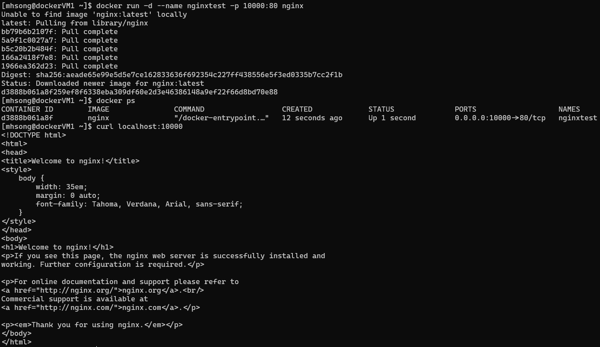

### 2.2. 다운로드 받은 이미지 확인

```bash
$ docker images
```

# LAB 2. 이미지 빌드

## 1. application 준비

nodeserver directory 생성하고 다음의 `webserver.js` 코드 파일을 생성

### 1.1. `webserver.js`

- Port: 3000 으로 접속 시 host name 반환

```javascript
var http = require('http');
var os = require('os');
var hostname = os.hostname();

var app = http.createServer(function(request,response) {
    response.writeHead(200);
    response.end(hostname);
});

app.listen(3000);
```

## 2.1. Dockerfile 작성

```Docker
FROM node:12

WORKDIR /usr/src/app

COPY . ./

RUN npm install

EXPOSE 3000
CMD [ "node", "webserver.js" ]
```

### 2.2. 이미지 빌드

```bash
docker build  -t <docker-hub-id>/<image-name:version> .
```

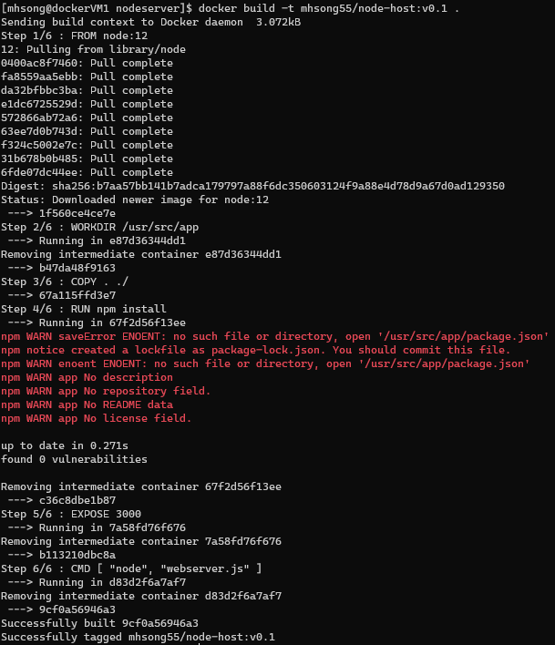

- image 생성 완료

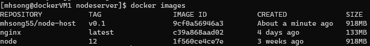

### 2.3. 생성한 iamge로 container 구동 및 검증

```bash
docker run -d --name <container-name> -p <host-port>:<container-port> <image-name>:<version>
```

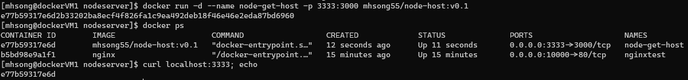

### 2.4. Docker Hub 로그인

```bash
docker login
```

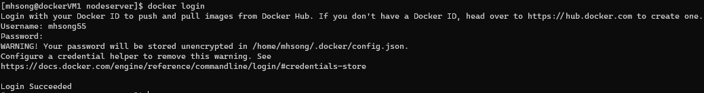

### 2.5. Image push to Docker Hub

```bash
docker push <docker-hub-id>/<image-name>:<version>
```

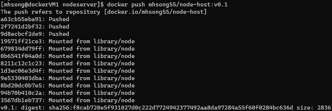

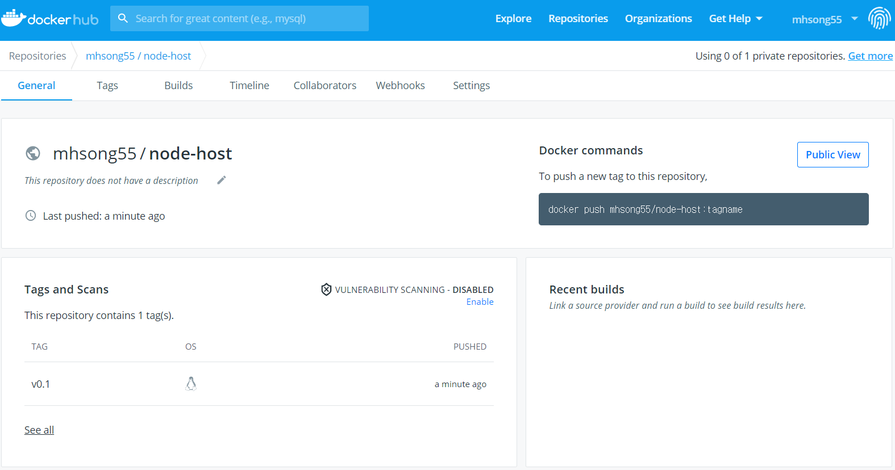

# LAB 3. Docker Swarm

## 1. Docker swarm 준비

- VM 2대 준비 및 각 VM에 Docker 설치

## 2. Docker Swarm 만들기

### 2.1. Swarm Manager 지정

- Swarm Manager로 사용할 VM에서 다음 command를 통해 Swarm Manager로 지정

```bash
docker swarm init --advertise-addr <Manager-IP>
```

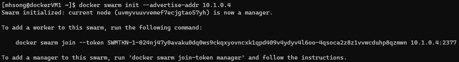

### 2.2. worker node를 해당 swarm 에 가입

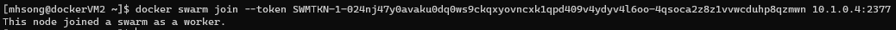

### 2.3. docker swarm node list 확인

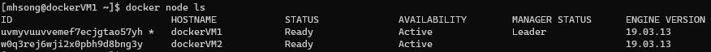

### 2.4. Swarm Container 생성

- Container replicas 1 개의 경우
  - build한 image로 container 구동

    ```bash
    docker service create --name node-host --publish published=10000,target=3000 mhsong55/node-host:v0.1
    ```

    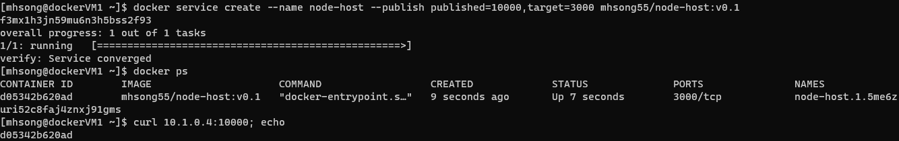

- Container scale-out

    ```bash
    docker service update node-host --replicas 3
    ```

    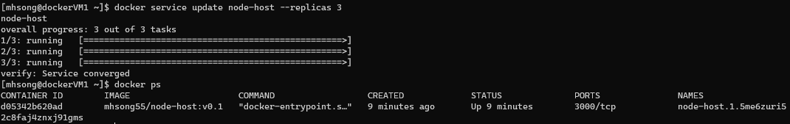

    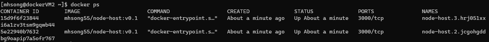

### 2.5. Load Balancing 검증

다음의 shell script로 Load Balancing 기능을 검증한다.

```bash
while :
do
curl 10.1.0.4:10000
sleep 0.5
echo
done
```

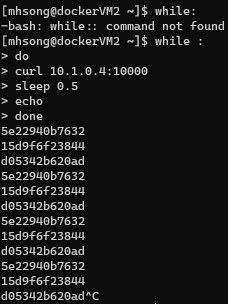

# Challenge - Azure Load Balancer의 백엔드로 배치해 통신 검증

## 1. Public Load Balancer 생성 및 구성

### 1.1. Public Load Balancer 생성

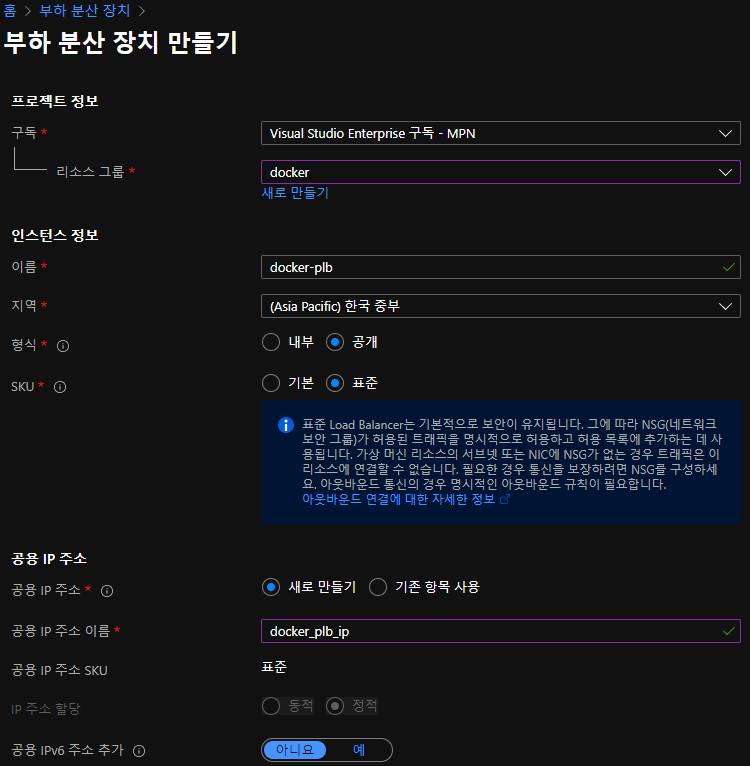

> PLB SKU를 `Standard`로 생성한 이유
> - Basic LB의 경우, Backend pool에 넣을 수 있는 VM은 AvailabilitySet(or Zone)에 생성되어 있어야 한다.
> - VM의 AvailabilitySet 지정은 VM 생성 후에는 불가능하다.
> - Basic LB에 이미 생성한 VM을 Backend pool에 등록할 수 없다.

### 1.2. VM의 Public IP 해제

- Public IP가 연결된 VM은 LB의 Backend pool에 등록할 수 없다.

### 1.3. Public LB의 Backend pool에 VM 추가

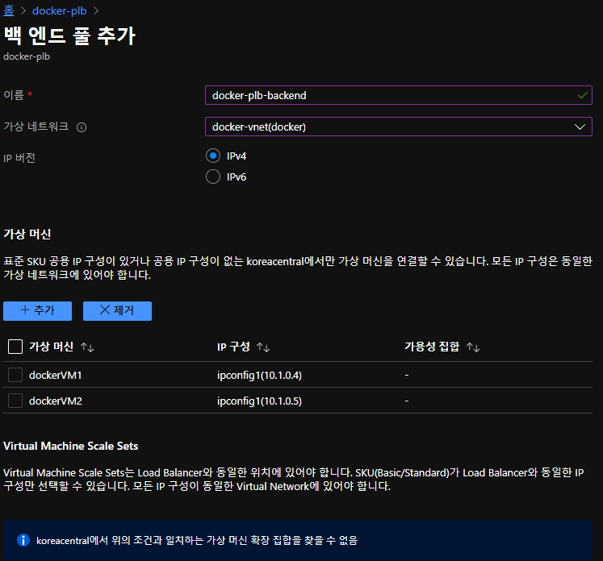

### 1.4. Public LB의 Load Balancing Rule 추가

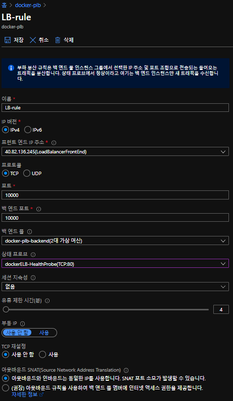

### 1.4.1. Public LB error handling

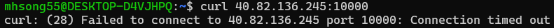

- External LB를 구성 후 ELB의 Public IP로 접근 시 `Connection time out` error 발생
- ELB의 인사이트에서 topology 확인


- Health probe 문제
- Health probe 